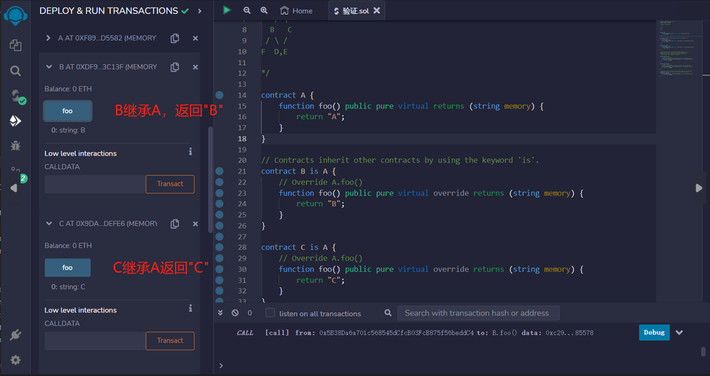
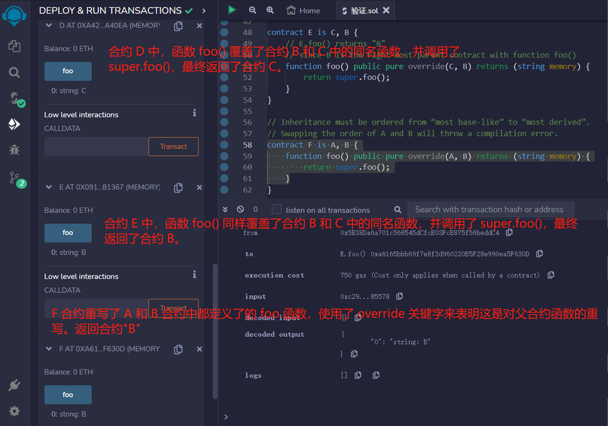

# 23.Inheritance

!!!!重载和重写的区别：
重载：即名字相同但输入参数类型不同的函数可以同时存在，他们被视为不停地函数
重写：在父合约中该函数被 virtual 修饰了，子合约中该函数使用 override 关键字重新实现了父函数中该方法，重写会覆盖父合约中的同名函数。

继承是面向对象编程很重要的组成部分，可以显著减少代码的重复。
Solidity 支持多重继承,合约可以使用 is 关键字继承其他合约.

规则:

- 修饰器可以继承的修饰符，包括 external, public, internal, private, and pure.
- 事件不能继承，但可以重载
- fallback/receive 可以继承，但是需要把保持原有的 payable/non-payable
- virtual: 父合约中的函数，如果希望子合约重写，需要加上 virtual 关键字。
- override：子合约重写了父合约中的函数，需要加上 override 关键字。

- 多重继承：solidity 的合约可以继承多个合约，但如果某个函数在多个继承的合约里都存在，崽子合约里必须重写，并且 override 关键字后面要加上所有父合约的名字，例如 override(ParentA, ParentB).

- 钻石继承：如果在继承链条，一个派生类同时有两个或两个以上的基类（如下面的继承关系图中 ABEC），成为钻石继承或菱形继承.
  继承的顺序很重要。

必须按照从“most base-like” 的到 “most derived”的顺序列出父合约。

```solidity
/* 继承关系图
    A
   / \
  B   C
 / \ /
F  D,E

*/

contract A {
    function foo() public pure virtual returns (string memory) {
        return "A";
    }
}
```

合约通过使用关键字 'is' 继承其他合约

```solidity
contract B is A {
    // 覆盖 A.foo()
    function foo() public pure virtual override returns (string memory) {
        return "B";
    }
}

contract C is A {
    // 覆盖 A.foo()
    function foo() public pure virtual override returns (string memory) {
        return "C";
    }
}
```

solidity 的合约可以继承多个合约。
继承时要按辈分最高到最低的顺序排。
当调用在不同合约中多次定义的函数时，父契约将从右向左搜索，并以深度优先的方式进行搜索。

```solidity
contract D is B, C {
    // D.foo() 返回 "C"
    // 因为 C 是带有函数 foo() 的最右侧的父合约
    function foo() public pure override(B, C) returns (string memory) {
        return super.foo();
    }
}

contract E is C, B {
    // E.foo() 返回 "B"
    // 因为 B 是带有函数 foo() 的最右侧的父合约
    function foo() public pure override(C, B) returns (string memory) {
        return super.foo();
    }
}
```

继承必须按照从“most base-like” 的到 “most derived”的顺序进行排序。
交换 A 和 B 的顺序将会导致编译错误。

```solidity
contract F is A, B {
    function foo() public pure override(A, B) returns (string memory) {
        return super.foo();
    }
}
```

## remix 验证

1. 部署 A,B,C 合约，B 继承 A，返回"B";C 继承 A 返回"C",验证
   
2. 部署 D,E,F 合约，合约 D 和 E 都继承了合约 B 和 C。
   在合约 D 中，函数 foo() 覆盖了合约 B 和 C 中的同名函数，并调用了 super.foo()，最终返回了合约 C。
   在合约 E 中，函数 foo() 同样覆盖了合约 B 和 C 中的同名函数，并调用了 super.foo()，最终返回了合约 B。
   F 合约重写了 A 和 B 合约中都定义了的 foo 函数，使用了 override 关键字来表明这是对父合约函数的重写。
   
