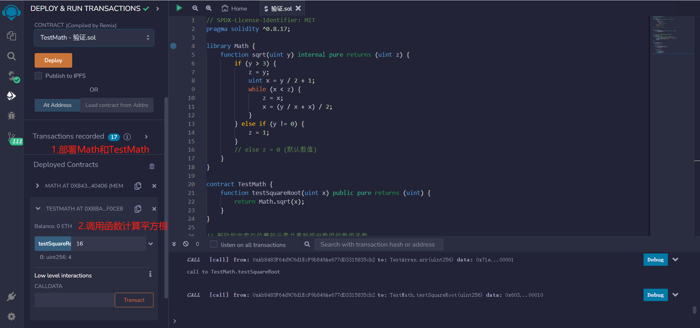
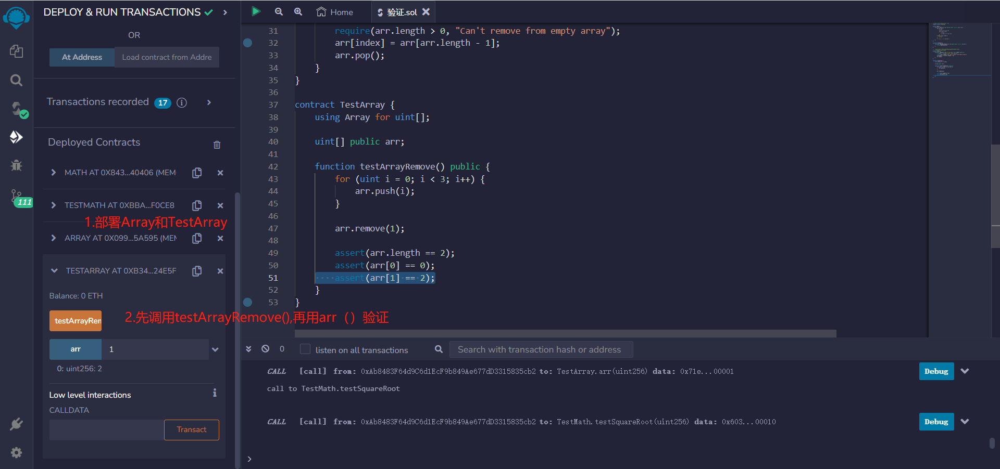

# 38.Library

library 类似于合约，是一种特殊的合约，为了提升 solidity 代码的复用性和减少 gas 而存在，一般由第三方提供。并且库合约不可以定义状态变量、不能继承或被继承、不可以被销毁，也不能发送 ETH。
库合约的函数可见性如果是 public/external，则在调用函数时是 delegatecall 的外部函数调用；可见性如果是 internal，则在调用函数时是内部函数调用。

使用 Library 可以避免代码重复，提高代码的可读性和可维护性。Library 还可以减少合约的大小，因为它们只需在合约中引用，而不需要在每个合约中都重新定义相同的代码。

在 Solidity 中，Library 可以被定义为一个单独的合约，但是它不能部署为独立的合约。相反，Library 的代码会被复制到使用它的合约中，从而实现代码的复用。

要使用 Library，需要在合约中引入 Library，并使用 Library 中的函数或变量。引入 Library 的方式是使用关键字“using”，并指定 Library 的名称。

例如，以下是一个简单的 Library 示例：

- 利用牛顿迭代法来逐步逼近平方根的值。如果传入的参数为 0，则返回 0；如果参数不为 0 且小于等于 3，则返回 1；否则，通过牛顿迭代法计算参数的平方根，并返回结果。

```solidity
library Math {
    function sqrt(uint y) internal pure returns (uint z) {
        if (y > 3) {
            z = y;
            uint x = y / 2 + 1;
            while (x < z) {
                z = x;
                x = (y / x + x) / 2;
            }
        } else if (y != 0) {
            z = 1;
        }
        // else z = 0 (默认数值)
    }
}
```

- 函数传入一个无符号整数 x，并使用 Math 库中的 sqrt 函数计算 x 的平方根，然后返回结果。

```solidity
contract TestMath {
    function testSquareRoot(uint x) public pure returns (uint) {
    return Math.sqrt(x);
    }
}
```

- 删除指定索引位置的元素并重新组织数组的数组函数,以便元素之间没有间隙。

```solidity
library Array {
    function remove(uint[] storage arr, uint index) public {
        // 将最后一个元素移动到要删除的位置上。
        require(arr.length > 0, "Can't remove from empty array");
        arr[index] = arr[arr.length - 1];
        arr.pop();
    }
}
```

- 数组中添加三个元素，然后删除第二个元素，并检查数组的长度和剩余元素是否符合预期。

```solidity
contract TestArray {
   using Array for uint[];

   uint[] public arr;

   function testArrayRemove() public {
       for (uint i = 0; i < 3; i++) {
           arr.push(i);
       }

       arr.remove(1);

       assert(arr.length == 2);
       assert(arr[0] == 0);
       assert(arr[1] == 2);
   }
}
```

## remix 验证

1. 部署 Math 的库和 TestMath 的合约。调用 testSquareRoot（）函数计算平方根，查看结果
   
2. 部署 Array 的库和 TestArray 的合约。调用 testArrayRemove()函数往数组中添加三个元素，然后删除第二个元素，并检查数组的长度和剩余元素是否符合预期。
   
