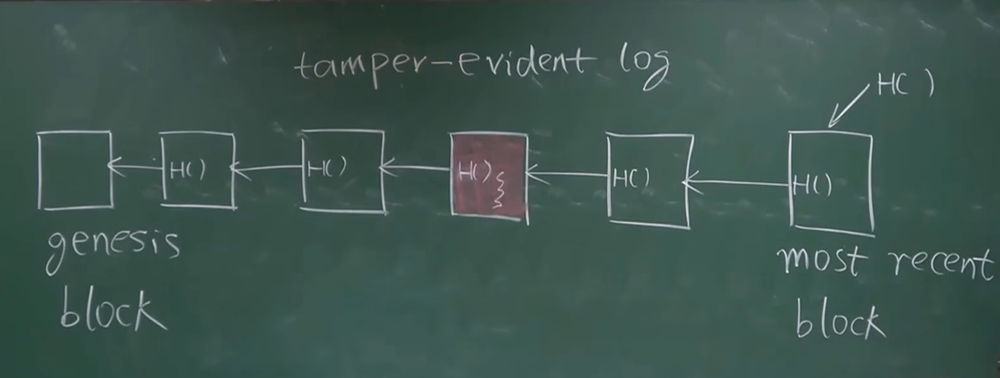
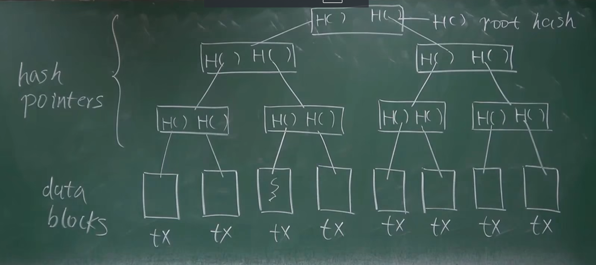
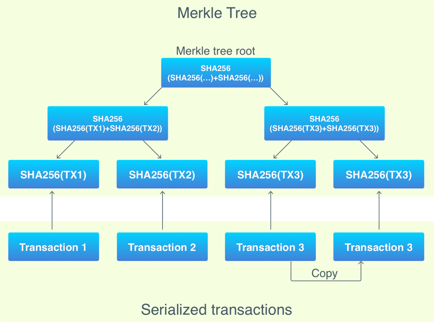
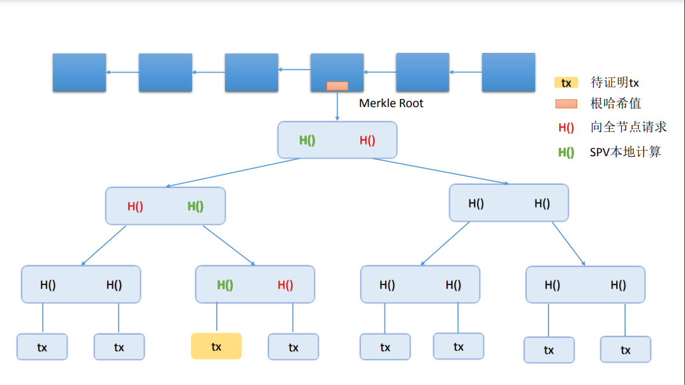

# 第三讲：比特币中的数据结构

## 概述

比特币系统中的数据结构是理解整个系统工作原理的基础。本讲将详细介绍比特币中使用的核心数据结构，包括哈希指针、Merkle 树等。

---

## Hash Pointers（哈希指针）

**Hash Pointers（哈希指针）**是一种结合了指针和哈希值的数据结构，广泛应用于区块链、密码学和数据完整性验证等领域。

### Hash Pointer 的概念

- **指针部分**：指向某个数据块或数据对象的存储位置，类似于传统的指针
- **哈希值部分**：存储指向的数据块的哈希值

### Hash Pointer 的重要特性

1. **数据定位**：指针部分可以定位到实际的数据位置（通常是内存地址或存储单元）
2. **数据完整性验证**：哈希值部分用于验证指针所指向的数据是否被篡改。通过重新计算指向数据的哈希值并与存储的哈希值进行对比，可以检测出任何数据的变化

### Hash Pointer 的应用

#### 1. 区块链

在区块链中，Hash Pointer 是区块链数据结构的基础。例如，**比特币区块链中，每个区块包含一个指向前一个区块的哈希指针**。这意味着每个区块不仅包含对前一个区块的引用，还包含前一个区块的哈希值，从而确保了区块链的不可篡改性。

如果某人试图篡改历史区块中的数据，他们必须修改所有后续区块的哈希值，这几乎是不可能的。

#### 2. Merkle 树

Merkle 树是一种基于哈希指针的数据结构，常用于验证数据的完整性。Merkle 树的叶节点是数据的哈希值，而每个非叶节点是其子节点哈希值的组合哈希。根节点的哈希值称为 Merkle 根，通过这个哈希值可以验证整个树的完整性。

#### 3. 数据版本控制

在版本控制系统中，Hash Pointer 可以用于跟踪文件或数据对象的历史版本。每个版本的对象通过哈希指针指向其前一个版本，从而构建一个链条，这样可以有效地管理和验证不同版本之间的差异和完整性。

### Hash Pointer 的优点

- **安全性**：通过哈希值的验证，可以确保数据的完整性和防篡改性
- **高效性**：在数据存储和版本控制中，Hash Pointer 提供了一种高效的数据引用和验证机制
- **不可篡改性**：一旦数据被记录下来并形成哈希指针链条，任何篡改都会破坏链条的完整性，从而被检测出来

---

## Tamper-Evident Log

哈希指针的一个主要优点是它提供了一种不可篡改的日志（tamper-evident log）。

- **完整性验证**：由于每个区块都包含前一个区块的哈希值，任何对某个区块的篡改都会改变该区块的哈希值，从而导致其后所有区块的哈希值发生变化。这样，篡改行为可以很容易地被检测到
- **防篡改链**：因为每个区块都依赖前一个区块的哈希值，如果某人试图修改一个区块，不仅需要修改该区块，还需要修改其后的所有区块，这几乎是不可能完成的任务

---

## Merkle Tree

**Merkle Tree（默克尔树）**是一种用于验证数据完整性的树形结构，广泛应用于分布式系统、区块链和文件系统中。它通过哈希函数确保数据的不可篡改性。

### Merkle Tree 在比特币中的应用

在比特币系统中，Merkle Tree 是用于组织和验证交易数据的一种重要结构。它的基本单元是底层的数据块，这些数据块实际上是一笔笔交易。

每个 block 有一个默克尔树，树中每个叶子节点是一个交易的 hash 值（比特币使用双重 SHA256 哈希）。叶子节点的数量一定是偶数，然后并非每个 block 都恰好有偶数个交易。当 block 有奇数个交易时，最后一个交易会被复制一次（复制仅仅发生在默克尔树中而不是 block 中！）。

默克尔树自下而上的进行组织，叶子节点成对分组后将两个 hash 值组合后生成新的 hash 值，形成上层的树节点，重复整个过程直到只有一个树节点为止，也就是所说的根节点。**根节点的 hash 值是整个交易集的唯一标识，保存在 block 头信息中，用于 PoW 过程。根节点（Root Hash）代表了整个树的哈希值，只要记住这个根哈希值，就可以检测到整个树上的任意修改。**

### Merkle Proof

Merkle Tree 的一个重要好处是可以进行 Merkle Proof。Merkle Proof 是一种用于证明某个数据块（交易）存在于一棵给定的 Merkle Tree 中的方法。

#### 全节点与轻节点

- **全节点**：保存了整个区块链的所有数据，包括所有的交易和块
- **轻节点**：仅保存区块头（Block Header），而不保存所有交易数据

#### 轻节点的交易验证

假设你在手机上运行的是一个轻节点，如果我给你做了一笔转账，你需要验证这笔交易已经存在于区块链中，这时就需要用到 Merkle Proof。

#### 验证过程

- **接收路径（Merkle Proof）**：轻节点从全节点或其他来源接收一个路径，这个路径包括从目标交易到根哈希的所有哈希值
- **验证路径**：轻节点使用这个路径验证该分支路径的哈希值与最终的区块头（Block Header）是否一致。如果一致，就证明该交易存在于区块链中。这个过程证明的是`Proof of Membership`，其复杂度是 `O(log⁡n)`

#### Proof of Non-Membership

如何证明某个交易不在区块链中（Proof of Non-Membership），当前没有比较高效的方法，只能一个个查验，其复杂度是 O(n)。

#### Sorted Merkle Tree

如果交易数据是有序的，根据哈希值排序，这种结构被称为 `Sorted Merkle Tree`。这种结构允许快速查找某个交易是否存在。但比特币并没有用这种结构，它不需要这个功能，排序也是需要额外代价的。

---

## 数据结构的特点总结

### 哈希指针的特点

1. **安全性**：通过哈希值验证数据完整性
2. **不可篡改性**：任何修改都会被检测到
3. **高效性**：提供快速的数据引用和验证机制

### Merkle 树的特点

1. **完整性验证**：通过根哈希值验证整个数据集
2. **高效证明**：提供 O(log n)复杂度的成员证明
3. **防篡改**：任何数据修改都会改变根哈希值

### 在比特币中的应用

1. **区块链链接**：通过哈希指针连接区块
2. **交易验证**：通过 Merkle 树验证交易
3. **轻节点支持**：为轻节点提供高效的验证机制

---

## 总结

### 核心概念

- **哈希指针**：结合指针和哈希值的数据结构
- **Merkle 树**：基于哈希的树形结构，用于数据完整性验证
- **Tamper-Evident Log**：不可篡改的日志系统

### 在比特币中的作用

1. **数据完整性**：确保区块链数据不被篡改
2. **高效验证**：为轻节点提供高效的验证机制
3. **安全性保障**：通过密码学技术保障系统安全
