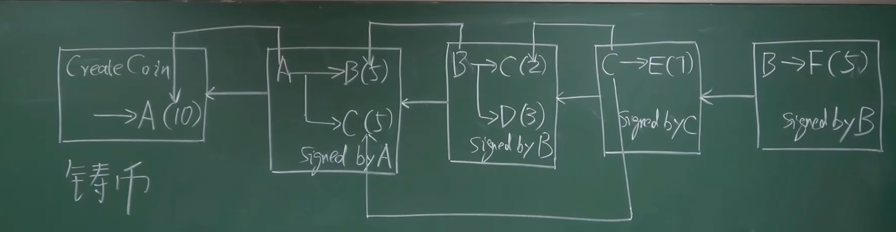
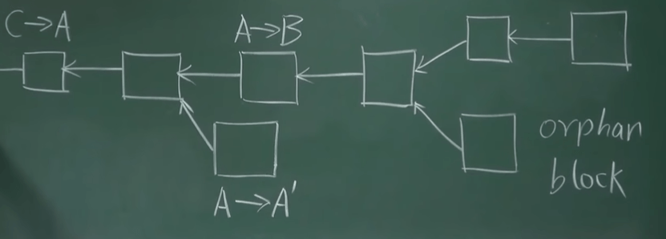

# 第四讲：比特币的共识协议

## 概述

比特币协议包括铸币、交易过程和防止双花攻击等机制。本讲将详细介绍比特币的共识协议，包括工作量证明、分布式共识等核心概念。

---

## BTC 协议

### 铸币和交易过程

每笔交易包含输入和输出部分：

- **输入部分**：说明币的来源（即之前的交易）和转账人的公钥。转账人的公钥需要与币来源的公钥相匹配，确保合法性
- **输出部分**：指明收款人的公钥。这次交易需要有发送人的签名，确保交易是由合法的持币人发起的

哈希指针用于指向之前的某个交易，证明这部分钱的来源，防止凭空捏造币。这个机制也防范了双花攻击。

---

## Double Spending Attack 双重支付攻击（双花攻击）

是指在网络上的数字货币系统中，攻击者试图在同一时间内将同一笔货币资产花费两次。这种攻击如果成功，会导致同一笔货币被两个不同的接收者接受，从而造成货币的重复使用。

### 双花攻击的防范机制

比特币通过以下机制防止双花攻击：

- **区块链共识**：每笔交易都需要被矿工打包进区块，并通过共识机制确认
- **交易验证**：当一个新的区块被广播时，网络中的所有节点都会验证其中的每笔交易是否合法，检查是否有双花行为
- **最长链规则**：比特币网络会选择最长的合法链。如果双花交易发生在不同的区块中，只有包含在最长链中的交易会被认可

### 双花攻击检测示例

假设 Alice 试图将同一笔比特币分别转给 Bob 和 Charlie：

1. **广播两笔交易**：Alice 向 Bob 和 Charlie 分别发起两笔相同输入的交易，并几乎同时广播到网络中
2. **矿工打包**：矿工收到这两笔交易，并分别打包进不同的区块中，形成两个分叉
3. **分叉传播**：网络中的节点会接收到这两个分叉的区块链，暂时分裂为两个分支
4. **最长链选择**：随着时间推移，矿工继续挖矿并生成新区块。当某个分支被延长，形成新的最长链时，另一个分支的区块将被丢弃，成为孤块
5. **交易确认**：最终，只有包含在最长链中的交易会被确认和接受。此时，Alice 的双花攻击会失败，因为只有一笔交易会被区块链网络接受，另一笔交易会被回滚

比特币挖矿每十分钟一个区块，其实也是为了防止分叉攻击，不然时间太短，叉太多，就容易被攻击。

---

## 区块结构

每个区块由区块头（Block Header）和区块体（Block Body）组成。

### 区块头包含以下字段：

- **版本号（version）**：表明区块的版本
- **前一个区块的哈希值（previous block hash）**：指向前一个区块，确保链条的连续性
- **Merkle 根（Merkle root）**：当前区块中所有交易的哈希值经过 Merkle 树计算得到的根哈希
- **时间戳（timestamp）**：记录区块创建的时间
- **难度目标（nbits）**：当前区块的挖矿难度
- **随机数（nonce）**：用于挖矿的计数器

**区块体**包含一个交易列表（transaction list），记录所有包含在该区块中的交易。

### 区块验证

其他节点收到新区块后，会进行一系列验证，以确保区块的合法性：

- **哈希值验证**：检查区块头的哈希值是否小于难度目标
- **前一个区块的哈希**：验证前一个区块的哈希值是否与本地链的最后一个区块匹配
- **交易验证**：验证区块中的每笔交易是否合法，包括：
  - 签名有效性：检查交易的签名是否由合法的私钥生成
  - 双花检测：确保每笔输入没有在之前的区块中被花费
- **Merkle 根验证**：检查交易列表的 Merkle 根是否与区块头中的 Merkle 根一致

如果区块通过所有验证，它将被添加到本地区块链中，否则将被拒绝。

---

## 分布式共识

### 分布式共识的挑战

可否各个节点独立完成区块链构建？
很明显不行，各个节点独立打包交易，形成区块链，必然无法避免区块链内容不一致。从分布式系统角度来说，账本内容需要取得分布式共识，从而保证区块链内容在不同节点上的一致性。

### 分布式系统的理论限制

- 根据 **FLP 不可能结论**，在一个异步系统中，网络时延无上限，即使只有一个成员是有问题的，也不可能达成共识
- 根据 **CAP Theorem**（Consistency 一致性、Availability 可靠性、Partition tolerance 容错性），任何一个分布式系统中，最多只能满足其中两个性质
- 分布式共识中协议 Paxos 可以保证 Consistency（若达成共识必然一致），但在某些情况下，可能会一直无法达成共识

### 女巫攻击（Sybil Attack）

在分布式系统中是一种常见的攻击方式，指的是一个恶意节点通过控制多个身份来影响网络中的共识过程。

在比特币的分布式共识机制——工作量证明（Proof of Work，PoW）中，女巫攻击的具体影响如下：

- **身份伪造**：攻击者创建大量虚假身份（节点），在网络中伪装成不同的参与者
- **影响共识**：通过控制大量节点，攻击者可以试图影响比特币网络中的共识决策过程，例如在比特币的分叉选择中，攻击者可以使网络认为其伪造的链是合法的，从而尝试推翻真实的区块链
- **网络分割**：攻击者可以利用这些虚假身份对网络进行分割，使得网络中的部分节点无法接收到其他节点的信息，从而破坏网络的去中心化特性

### 比特币的解决方案

谈到共识，我们可能会想到投票，但是任何基于投票的共识协议都有一个投票权的问题，可能会存在女巫攻击，在比特币系统中简单的采用投票来确定共识是不行的。

比特币网络通过 **工作量证明（Proof of Work, PoW）** 来实现分布式共识，确保所有节点就区块链的状态达成一致。其核心思想是通过消耗计算资源来防止女巫攻击和其他恶意行为。

#### 具体过程如下：

- **挖矿过程**：矿工竞争性地进行大量的哈希运算，试图找到一个满足特定条件的哈希值（即目标值以下的哈希）
- **哈希值计算**：矿工对区块头进行哈希运算，区块头包括前一个区块的哈希值、当前区块中的交易 Merkle 根、时间戳、难度目标（nbits）和随机数（nonce）
- **目标值**：难度目标（nbits）决定了哈希值必须小于的目标值。随着网络计算能力的变化，难度调整每 2016 个区块（大约两周）进行一次。确保新区块生成时间约为每 10 分钟一次。如果区块生成过快，难度会增加；如果生成过慢，难度会降低

---

## 比特币共识协议

### 背景

假设系统中存在部分节点有恶意，但存在比例较小。大多数节点为"好"的节点，在这种情况下进行共识协议设置。

#### 想法 1：直接投票

某个节点打包交易到区块，将其发给其他节点，其他节点检查该候选区块，检查若正确投赞成票，若票数过半数，加入区块链。

#### 存在的问题

1. **恶意节点不断打包不合法区块**，导致一直无法达成共识，时间全花费在投票上
2. **无强迫投票手段**，某些节点不投票（行政不作为）
3. **网络延迟事先未知**，投票需要等多久？效率上会产生问题

#### 更大的问题 —— membership(资格)

如果是联盟链（hyperledger），对加入成员有要求，可以基于投票。
但比特币系统，任何人都可以加入，且创建账户及其简单，只需要本地产生公私钥对即可。只有转账（交易）时候，比特币系统才能知道该账户的存在。这样，黑客可以使用计算机专门生成大量公私钥对，当其产生大量公私钥对超过系统中一半数目，就可以获得支配地位（女巫攻击`Sybil Attack`）。所以，这种简单的投票方案也是不可行的。

### 比特币的巧妙解决方案

比特币系统中采用了很巧妙的方案解决这个问题。虽然仍然是投票，但并非简单的根据账户数目，而是依据计算力进行投票。

在比特币系统中，每个节点都可以自行组装一个候选区块，而后，尝试各种`nonce`值，这就是挖矿。
`[H(block header)<=target]` 当某个节点找到符合要求的`nonce`，便获得了记账权，从而可以将区块发布到系统中。
其他节点受到区块后，验证区块合法性，如果系统中绝大多数节点验证通过，则接收该区块为最新的区块并加入到区块链中。

> 区块合法，但不一定就能接收。得满足区块在最长合法（longest valid chain）链上。

---

## 共识协议和分叉处理

### 最长链规则

比特币网络采用最长链规则来决定哪条链是合法的。即所有节点选择包含最多工作量（即最长）的合法链。这样确保了网络的一致性和**防止分叉攻击（forking attack）**。

> 如果是等长，怎么办？那就看谁先找到下一个区块成为最长区块链了。

### 分叉处理

如果两个矿工几乎同时找到有效区块，会出现链的分叉。此时：

- **暂时分叉**：网络中的节点会临时分裂为两个分支，分别接收其中一个区块
- **最终选择**：当一个分支被后续区块延长并超过另一个分支时，较短分支上的区块将被丢弃，成为孤块（orphan block）
- **回滚交易**：孤块上的交易会被回滚到未确认状态，并可能被包含在后续的区块中

---

## 比特币激励机制

> 为什么系统中节点要竞争记账权？需要提供算力和电力成本，节点为什么要去做？

比特币系统设计之初便考虑到了这个问题，那就是引入激励机制`block reward`。
比特币通过设置出块奖励来解决该问题，一个获得合法区块的节点，可以在区块中加入一个特殊交易（铸币交易）。事实上，这种方式也是唯一一个产生新比特币的途径。

### 激励机制的具体内容

矿工在成功找到满足条件的哈希值后，获得记账权并将新区块广播到全网。新区块包含一个特殊的交易（**铸币交易 coinbase transaction**），用于奖励矿工：

- **出块奖励**：最初的出块奖励为`50 BTC`，每经过 210,000 个区块（约 4 年）奖励减半。当前（2024 年）奖励为`6.25 BTC`
- **交易费用**：除了出块奖励，矿工还可以获得包含在区块内交易的交易费用。这些费用由交易发起人支付，作为矿工打包交易的激励

---

## 总结

### 核心概念

- **工作量证明（PoW）**：通过计算力竞争获得记账权
- **最长链规则**：选择包含最多工作量的合法链
- **分叉处理**：通过共识机制解决分叉问题
- **激励机制**：通过出块奖励和交易费激励矿工

### 比特币共识的特点

1. **去中心化**：不依赖中心化机构
2. **安全性**：通过密码学和共识机制保障安全
3. **公平性**：基于计算力进行竞争
4. **激励机制**：通过奖励机制维持系统运行
