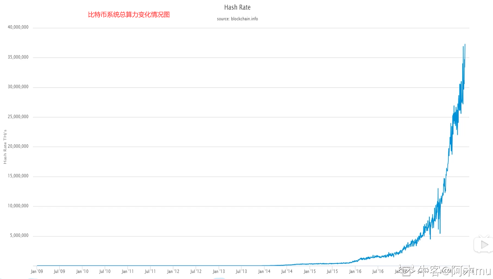
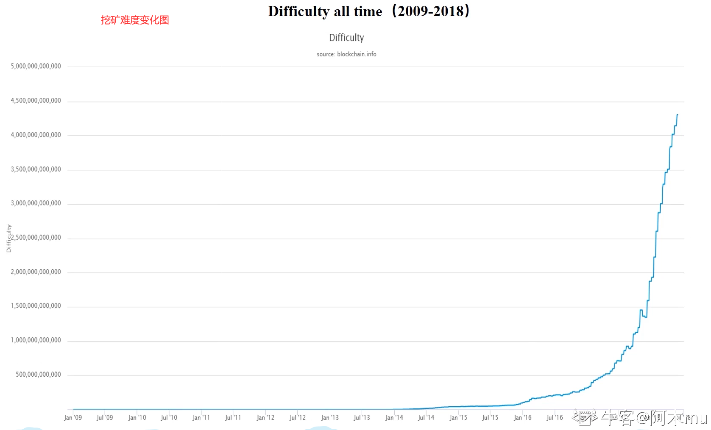

# 第七讲：BTC 挖矿难度调整

## 概述

之前有提到过，在比特币系统中，区块链的出块时间保持在平均`10min`左右。毫无疑问的是，伴随着参与挖矿的人增多，系统总算力不断增强，挖矿的难度绝对不能一成不变。
实际上，在比特币系统开发过程中，中本聪便考虑到了这个问题，并设计了一个相应的难度调整算法。这一篇，便了解一下比特币系统中的挖矿难度调整算法。

---

## 为什么要调整挖矿难度

之前已经提过，挖矿本质上就是不断调整`block header`中的`nonce`值，使整个`block header`的哈希值小于等于给定的目标阈值。即：`H(block header)<=target`。（target 便是目标阈值，target 越小，目标难度就越大）对于挖矿难度的调整，可以视为调整目标空间在整个输出空间中所占比例大小。

> 之前有提及，比特币系统采用的哈希算法为`SHA-256`，所以整个输出空间大小为`2^256`，调整目标空间所占比例，简单的说需要目标值前需要多少个 0。
> 当然，挖矿难度和目标阈值成反比，如下图所示，其中 difficulty_1_target 为`是挖矿难度为 1 时候的 target，即最小挖矿难度
> 挖矿难度公式可以表示为：

> `difficulty = difficulty_1_target / target`
>
> 其中：`difficulty_1_target` 是比特币网络中的一个固定值，通常表示为`0x00000000FFFF0000000000000000000000000000000000000000000000000000`。
>
> `target`是当前区块的目标值，由网络根据算力动态调整。

### 1. 如果不调整挖矿难度会怎么样？

系统总算力越来越强，若挖矿难度保持不变，则出块时间会越来越短。

### 2. 出块时间越来越短是好事吗？

出块时间缩短，那么交易可以很快便被写入区块链，并且提高了系统响应时间，增加了区块链系统效率。
但是，出块时间并不是越短越好。出块时间太短，也会造成一定的问题。首先，区块在网络上传播具有时延，假如出块时间为 1 秒，但网络传播需要 10 秒，则会使得系统中节点经常性处于不一致的状态，增加了系统不稳定性，且系统经常性位于分叉状态（不仅二分叉，乃至多分叉）。分叉过多，则不利于系统达成共识，且会造成算力分散，使得黑客攻击成本大大降低(不再需要整个系统 51%的算力)。

### 3. `10min`的出块间隔是最优吗？

当然不是，但可以确定的是，系统出块时间需要维持在一个定值附近。后续文章中会介绍以太坊，以太坊中平均出块时间仅为 15 秒左右，但同样在以太坊中也有相应难度调整算法维持其平均出块时间(后续会写文介绍)，当然 15s 的时间明显会产生经常性的分叉，所以以太坊设计了新的共识协议 Ghost（后续文章中会介绍）。

对于一个交易系统来说，10min 这样一个交易时间是比较长的。但对于跨国交易来说，这个时间反而大大缩短了交易时间，减少了相应成本。

---

## BTC 系统如何调整挖矿难度

在 BTC 协议中规定，每隔 2016 个区块需要调整一次难度，根据 10min 产生一个新区块可以得到，大概需要 14 天的时间。具体调整公式如下：

> 可见，如果实际实际比较长，`target`会比较大，相应的挖矿难度会降低；如果实际实际比较短，`target`会比较小，相应的挖矿难度会增大。

当然，上调和下调都是有 4 倍的限制。例如：实际最近 2016 个区块出块时间超过 8 个星期(正常 2 个星期)，计算也只按照 8 个星期计算；
实际最近 2016 个区块出块时间小于 0.5 个个星期(正常 2 个星期)，计算也只按照 0.5 个星期计算.这样是为了防止网络中出现黑天鹅事件。

### 如何让所有矿工都愿意调整这个挖矿难度呢？

这一调整算法在代码中已经写入，如果有恶意节点故意不调，其所产生的区块不会被大多数诚实的节点承认。
在`block header`中有一个`nbits`的域，它是对`target`的编码存储（`target`为 256 位，`nbits`为 32 位，也就是说 block header 并未直接存储`target`），其他节点在进行合法性验证时候会验证`nbits`域是否合法，不合法则对该区块不予以承认。

### 思考：比特币出现之后也曾经涌现出一大堆数字货币，为什么偏偏比特币存活了下来？

很大程度上是由于比特币设计本身注重鲁棒性而非高效，使得系统的健壮性极高。可见实际工业应用，不应该一味追逐新技术的应用，实际上来说，哪一种能更好解决我们的实际问题就用哪种。
像区块链技术火起来之后的炒币浪潮，其中又有多少是披着区块链皮的项目呢？更别说火极一时的区块链养狗，养猫之类的项目，实际上根本不需要用上区块链技术！

---

## 其他统计数据

### 1. 比特币系统总算力变化情况图

> 需要注意的是，之前一段并非直线，而是之后增长太猛导致之前增长趋势看上去太低。

### 2. 挖矿难度变化图

> 可以看到，和系统算力变化情况基本同步（符合难度调整预期目标）

> 思考：挖矿难度变低是好事吗？
> 对于矿工来说，挖矿难度变低，挖矿变得更容易，这也说明大多数人对该币种不再看好，这个币种的价值也会大跳水，这对矿工来说可是一个坏消息。

### 3. 2010-2018 每天出块时间图

> 可见基本维持在 10min 左右上下波动，达到预期设计目标

---

## 总结

### 核心概念

- **难度调整**：根据算力变化动态调整挖矿难度
- **目标阈值**：决定挖矿难度的关键参数
- **调整周期**：每 2016 个区块调整一次
- **限制机制**：防止难度变化过大

### 难度调整的重要性

1. **维持出块时间**：保持平均 10 分钟的出块间隔
2. **系统稳定性**：避免出块时间过短导致的分叉
3. **公平性**：确保挖矿竞争的公平性
4. **安全性**：防止攻击者利用算力优势

### 比特币系统的特点

1. **自适应**：能够根据算力变化自动调整
2. **鲁棒性**：系统设计注重稳定性而非效率
3. **公平性**：通过难度调整保证挖矿公平
4. **安全性**：通过共识机制保障系统安全
