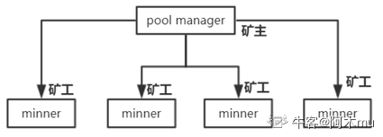
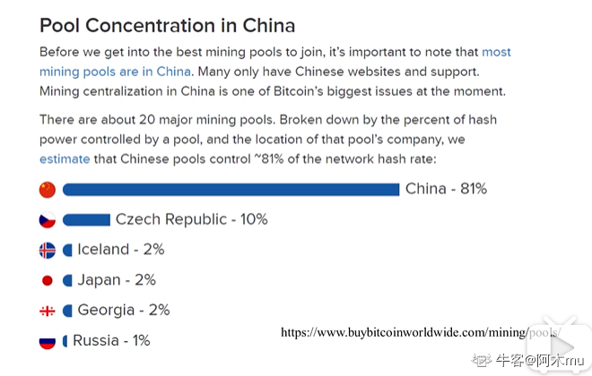

# 第八讲：BTC 挖矿篇

## 概述

在之前的文章，已经基本上介绍完了比特币系统的原理。本篇，将对之前内容简单总结并说明目前挖矿出现的趋势。

---

## 全节点和轻节点

> 之前提到，由于硬件限制，BTC 系统中分为轻节点和全节点，下表阐述了全节点和轻节点的区别

| **特性**           | **全节点**                                                     | **轻节点**                                               |
| ------------------ | -------------------------------------------------------------- | -------------------------------------------------------- |
| **在线状态**       | 一直在线                                                       | 不是一直在线                                             |
| **区块链数据存储** | 在本地硬盘上维护完整区块链信息                                 | 不保存整个区块链，只需要保存每个区块块头                 |
| **UTXO 集合**      | 在内存中维护 UTXO 集合，以便快速检验交易合法性                 | 不保存全部交易，只保存和自己有关的交易                   |
| **交易验证**       | 监听比特币网络中交易内容，验证每个交易合法性                   | 无法验证大多数交易合法性，只能检验和自己相关的交易合法性 |
| **区块打包**       | 决定哪些交易会打包到区块中                                     | 无法检测网上发布的区块正确性                             |
| **区块验证**       | 监听其他矿工挖出的区块，验证其合法性                           | 可以验证挖矿难度                                         |
| **挖矿**           | 1. 决定沿着哪条链挖下去。 2. 当出现等长分叉，选择哪一个分叉 | 只能检测哪个是最长链，不知道哪个是最长合法链             |

在比特币网络中，大多数节点都是轻节点。如果只是想进行转账操作，不需要挖矿，就无需运行一个全节点。在挖矿过程中，如果监听到别人已经挖出区块延申了最长合法链，此时应该立刻放弃当前区块，在本地重新组装一个指向最后这个新合法区块的候选区块，重新开始挖矿。

### 1. 这样是不是有些可惜？之前花费好多资源，全部白挖了。

实际上并不可惜。之前文章中提及，挖矿本身具有无记忆性，前面无论挖多久，对后续继续挖矿没有影响。

### 2. 比特币系统如何安全性？

一是密码学的保证：别人没有自己的私钥，就无法伪造其合法签名，从而无法将其账户上 BTC 转走。（前提：系统中大多数算力掌握在好人手中）
二是共识机制：保证了恶意交易不被系统承认。

---

## 挖矿设备演化

目前，挖矿设备逐渐趋于专业化，其经历了三个过程，总体趋势从通用到越来越专用。
**普通 CPU -> GPU ->ASIC 芯片（挖矿专用矿机）**

### CPU 挖矿阶段

> 实际上，挖矿本身就是计算，对于普通计算机来说，挖矿过程中大多数内存、硬盘、CPU 中大多数部件（用到指令较少）等都是闲置的，如果用普通计算机专门用于挖矿是根本不划算的。随着挖矿难度提高，用通用计算机挖矿很快变得无利可图。

> 所以，挖矿设备转入第二代——GPU(主要用于大规模并行计算，如：深度学习)。但是，用 GPU 挖矿，仍然有一定浪费(GPU 为通用并行计算设计，挖矿仍然有很多部件闲置。例如：浮点数运算部件，挖矿过程只使用整数操作，该部分部件根本不会用到)。

GPU 价格上涨，不仅仅是深度学习火热导致的吗？实际上，很多 GPU 被用于了挖矿。

### ASIC 芯片挖矿阶段

> 当然，目前 GPU 挖矿也已经不划算了（目前一些新开发货币仍然用 GPU 挖矿）。所以，开始进入第三代设备：ASIC 芯片（专门为挖矿设计的芯片），这种芯片专门为挖矿设计，只能用于特定币种的挖矿。
> 但 ASIC 芯片设计、流片流程很长，假如 BTC 价格剧烈变化，前期投入很可能会血本无归。所以，ASIC 芯片需要提前预订。假如 BTC 系统中，算力突然很猛烈增加，一般是一个大的厂商生产出新的 ASIC 矿机。

ASIC 芯片只能用于挖矿，一旦其过时，便完全作废。

### ASIC 芯片的出现是好事吗？

很明显，ASIC 芯片并不是普通人可以参与的，一定程度上提升了挖矿的门槛，违背了比特币系统去中心化的初衷。理想状态下，所有人用 CPU 挖矿，这样只要有一台家用计算机便可以参与挖矿。当然，后续有一些货币便考虑到了这个问题，设计了抗 ASIC 芯片化的解决方案，后续介绍以太坊时会对这种方案进行介绍。
但反过来想，如果大家都用 ASIC 矿机挖矿，如果有人想要颠覆 BTC 系统，必然会导致 BTC 价格跳水，从而导致其所购买 ASIC 矿机作废，投入成本血本无归。所以，很多人反倒认为 ASIC 芯片出现，一定程度上并不是坏事。

---

## 大型矿池出现

> 挖矿另一个趋势便是大型矿池的出现。对于单个矿工来说，即使使用了 ASIC 矿机，其算力在整个系统中仍然只占据很少一部分，即使从平均收益看有利可图，但收入很不稳定。
> 此外，单个矿工除挖矿还要承担全节点其他责任，造成了算力的消耗。

因此，为了解决这些问题，便引入了**矿池**的概念。
矿池的架构如下图，通常是一个全节点驱动多台矿机。矿工只需要不停计算哈希值，而全节点其他职责由矿主来承担。ASIC 芯片只能计算哈希值，不能实现全节点其他功能。此外，矿池出现解决了单个矿工收益不稳定的问题。当获得收益后，所有矿工对收益进行分配，从而保证了收益的稳定性。

> 所以，必须涉及如何分配的问题。如果分配不公平，挖矿的动力就会减少。

### 矿池的组织形式

矿池一般具有两种组织形式:

1. **类似大型数据中心（同一机构）**：集中成千上万矿机进行哈希计算。
2. **分布式**：矿工与矿主不认识(不同机构)，矿工与矿主联系，自愿加入其矿池，矿主分配任务，矿工进行计算，获得收益后整个矿池中所有矿工进行利益分配。

---

## 💰 矿池利益分配方法

假使第二种情况，矿工来源于五湖四海（非同一机构），收益应该如何分配？

### 思路一：平均分配

所有人平分出块奖励。

这一点有些类似我国某段历史时期，大家一起"吃大锅饭"，会导致某些矿工懈怠，不干活（挖矿要费电，需要成本）。
所以，这里也需要进行按劳分配，需要一个工作量证明的方案。如何证明每个矿工所作的工作量呢？

### 思路二：降低挖矿难度（可行方案）

假设原本挖矿难度要求，计算所得 126 位的哈希值前 70 位都必须为 0，现在降低要求，只需要前 60 位为 0，这样挖矿会更容易挖到。当然，这个哈希是不会被区块链所承认的，我们将其称为一个 share，或 almost valid share。矿工每挖到一个 share，将其提交给矿主，矿主对其进行记录，作为矿工工作量的证明。等到某个矿工真正挖到符合要求的的区块后，根据所有矿工提交的 share 数量进行分配。
因为每个矿工尝试的 nonce 越多，挖到矿的可能性越大，所能得到的 share 也会越多，所以这种方案作为工作量证明方案是可行的。

### 思考问题

**思考一**：有没有可能，某个矿工平时正常提交 share，但真正挖到区块后不提交给矿主而是自己偷偷发布出去，从而避免他人分走挖矿所得到的出块奖励？

事实上，这种情况是不可能的。因为每个矿工挖矿任务是矿主分配的。矿主组装区块，交给矿工计算，而区块中铸币交易的收款人地址是矿主，如果矿工修改该地址，计算的 nonce 值也会作废。

**思考二**：如果矿工自己刚开始就自己偷偷组装一个区块，自己挖矿，这样就类似于其脱离了该矿池呢?

因为其自己所组织的区块不会被矿主所认可，其提交的 share 也不会被认可，也就得不到分配的收益。

**思考三**：有没有可能矿工捣乱？平时提交 share，等挖到后扔掉区块，不提交？

这种可能是有的，如果矿工本身仅仅想捣乱，是可以这么做的。但扔掉区块后，对其本身来说，也没有相应的奖励获得，看似是损人不利己的情况。
但是，矿池之间存在竞争关系。有可能为了打击竞争对手，会派出矿机加入竞争对手矿池挖矿，从而起到搞破坏的作用。即只参与其他矿工挖矿分红，自己挖到的区块却丢掉不给他人分。

---

## 关于矿池的一些统计数据

### 矿池在各个国家分布比例图(2018 年)

> 可见，中国所占矿池比例远远超过其他国家。

### 2014 年图单个矿池算力分布比例图

这个时间，存在一个矿池(GHash.IO)算力比例占据全部算力一半以上，当时引起了恐慌(一个矿池就可以发动 51 攻击)。之后，该矿池主动降低了矿池算力（化整为零，实际上仍然存在发动 51 攻击能力），避免动摇人们对比特币信心。

### 2018 年图单个矿池算力分布比例图

表面看上去是安全的，但实际实上某个机构如果有超过 50%算力，其必然不会将其放入一个矿池中。而是将其分散隐藏，真正需要发动攻击时候再集中起来发动 51 攻击（注意：矿工转换矿池是很容易的）。

> 由这些数据可以得知，矿池本身对 BTC 系统带来了较大威胁。某个恶意用户如果想发动攻击，以前需要自己达到 51%算力，现在自己只需要作为矿主，只需要很少一部分算力就可以了。只要能够吸引到足够多的不明真相的矿工，便可以用较低成本实现 51 攻击。
>
> 当然，矿主经验管理矿池，也需要收取一定比例(出块奖励、交易费)作为管理费用。如果恶意者想要攻击系统，会将管理费降低甚至赔本吸引足够多矿工加入。这便使得发动 51%攻击变得容易了起来。

---

## 51%算力矿池可以发动哪些攻击

### 1. 分叉攻击

对已经经过 6 次确认的交易分叉，利用 51%算力将交易记录回滚。

> 矿工只能计算哈希值，并不知道区块包含哪些交易，区块链状况是什么。所以，这些"群众"是无知的，容易被利用（《乌合之众》当中提出的观点，大多数人真的就能掌握真理吗？）。
> 此外，51%攻击只是一个概率问题，并非达到 51%算力就能发动攻击，不能达到就无法发动攻击。此外，矿池本身算力也是在不断变化的。

### 2. 封锁交易

假如攻击者不喜欢某个账户 A，不想让 A 的交易上区块链，在监听到有其他人将 A 的交易发布到区块链上时，立刻发动分叉攻击，使 A 所在链无法成为"最长合法链"。这样，便实现了对 A 账户的封锁。

> 像不像即当裁判又当运动员？"堂下何人状告本官"？

### 3. 盗币（将他人账户 BTC 转走）

这个是不可能的，因为其并没有他人账户私钥。如果依仗算力强，强行将没有签名的转账发布到区块链，正常节点不会认为其合法，这样，即使这条链再长，其他人也不会认为其是最长合法链。

---

## 矿池出现的优劣

### 优点

- 解决了矿工收入不稳定的问题
- 减轻了矿工的负担
- 提高了挖矿效率

### 缺点

- 威胁到了区块链系统的安全
- 使得 51%攻击变得容易起来
- 增加了中心化风险

---

## 总结

### 核心概念

- **全节点与轻节点**：不同节点类型的职责分工
- **挖矿设备演化**：从 CPU 到 GPU 再到 ASIC 的发展历程
- **矿池机制**：解决个体矿工收益不稳定的问题
- **51%攻击**：矿池带来的安全威胁

### 挖矿发展的趋势

1. **专业化**：挖矿设备越来越专业化
2. **集中化**：矿池的出现导致算力集中
3. **规模化**：大型矿池占据主导地位
4. **安全风险**：矿池带来的 51%攻击风险

### 比特币挖矿的特点

1. **去中心化设计**：但实际运行中出现中心化趋势
2. **专业化发展**：从通用设备到专用设备
3. **规模化运营**：矿池成为主要挖矿方式
4. **安全挑战**：需要防范 51%攻击
