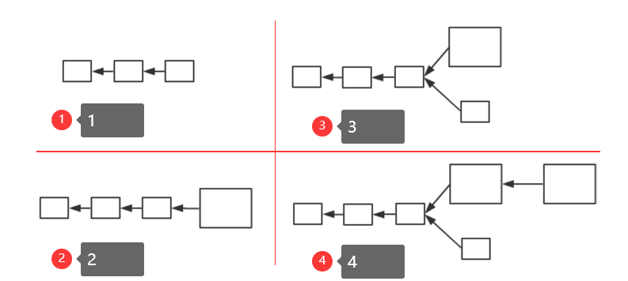
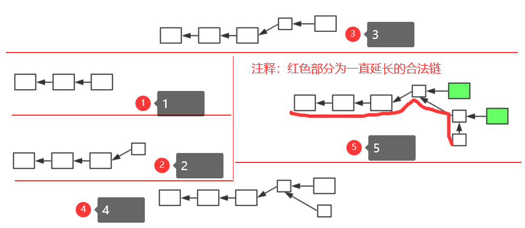

# 第十讲：BTC 分叉篇

::: info 介绍

本节介绍比特币系统中的分叉(`fork`)

分叉指的是，原来的系统中为一条链，但分成了两条链。分叉形成的原因可能有多种，例如：挖矿时两个节点差不多同时挖出矿，都会发布区块(对比特币系统当前状态产生分歧导致的分叉——`state fork`)；分叉攻击，同样也会导致分叉(`forking attack`，人为故意造成)；比特币协议改变，在分布式系统中不能保证所有节点同时升级软件，假设存在少数节点未升级，导致出现分叉(`protocal fork`)；

根据对比特币协议修改的不同，可以将分叉分为硬分叉和软分叉。

很多人都听说过硬分叉和软分叉，但对其实际含义并不了解，本篇便专门介绍比特币系统中的分叉。

## 硬分叉(`hard fork`)

> 什么情况会出现硬分叉？
>
> 对比特币协议增加新协议，扩展新功能，未升级软件的旧节点会不认可这些修改，会认为这些特性是非法的。这也就是对比特币协议内容产生分歧，从而导致分叉。
> 硬分叉的一个典型例子，就是对比特币区块大小的修改（之前有提到过，BTC 区块大小限制 1MB，但是否合适存在争议）

在 BTC 系统中，区块大小最大为 1MB，可以包含的交易最大数量为 4000 笔左右。而一个区块产生大概需要 10min 左右，也就是说，整个比特币系统，平均每 10 分钟最多只能处理 4000 笔交易(平均每秒 7 笔交易)，相比目前银行等金融机构每秒数十万数百万的交易量来说，根本不在一个数量级上，严重影响吞吐率和交易处理(即上链)时间(因为交易太多，无法写入只能等待下一个区块)。
所以，有人便认为可以增大区块大小，使得一个区块中可以包含的交易数量增多，在此，**我们假设将区块大小从 1MB 增大至 4MB**。

> 假设系统中大多数节点更新了软件，少数节点仍然遵从 1MB 限制的协议(注意，这里大多数和少数是按照算力来区分的，和账户数量无关)。即：新节点认为区块大小最大 4MB，旧节点认为区块大小最大 1MB，且新节点占据大多数。

假设 1 为当前区块链，此时软件更新，有一个新节点挖出了一个区块如 2。但对于旧节点来说，该区块为一个非法区块，旧节点不会对其认可，从而，旧节点仍然从其前一个区块开始挖矿，如 3.
需要注意的是，旧节点挖出的区块，新节点是认可的(并未超过 4MB 限制)，所以对旧节点来说，3 中下面的链才是合法链，而对新节点来说，这两条链都是合法的链。因为新节点算力强，所以出现 4 中情况可能性大。对于新节点来说，上面的为最长合法链，新节点便都会沿着上面的链继续挖；对于旧节点来说，上面的链无论多么长，都是一条非法链，不会认可该链，所以旧节点就会沿着下面的链继续挖矿。

此时，就出现了新节点永远沿着上面的链挖矿，旧节点永远沿着下面的链挖矿，由于新节点算力足够强，所以形成两条永远都在延伸且平行的链。当然，上面的链，也有可能会挖出大小在 1MB 内的小区块，但对旧节点来说，该链上存在非法区块，不会认可该链。可见，这种分叉是持久性的。

只要这部分旧节点永远不更新软件，下面的链便永远不会消失。

> 1.BTC 社区中有些人很保守，不愿意加大区块大小 2.区块大小并非越大越好，在网络篇中提到，比特币网络传输为"尽力而为"，区块加大会造成传输变慢等问题。 3.单纯增加区块大小，对交易数量的增加远不能达到数量级的提升。

出现`hard fork`后，便变成了两条平行的链，也就造成了社区分裂。社区中有一部分人，会认为下面的链才是"正统"(根正苗红)，各个链上的货币独立。

> 实际上，这个事情真正出现过。后续会介绍以太坊，以太坊历史上的一件大事就是硬分叉事件。以太坊称为 ETH，但目前看到的 ETH 已经不是最初的 ETH 了，以太坊在历史上发生过硬分叉，另一个链称为 ETC（和过高速公路那个 ETC 可半毛钱关系都没有呀）。实际上，ETC 才是以太坊设计原本的协议，而 ETH 是黑客攻击 ETH 上一个智能合约 THE DAO 后进行回滚的协议链(将黑客攻击偷取的以太币采用硬分叉方式回滚回到另一智能合约，然后退还给真正拥有者)。
> 但是这次硬分叉的后果，由于有人不愿意这么做，造成了以太坊社区的分裂。实际上，虽然 ETC 不如 ETH 又名，但实际它也是目前一种主流货币。
> 分叉之初，由于两个链分叉造成了互相影响，产生了很多麻烦。比如：在 ETH 链上有一笔转账 B->C，有人便在 ETC 链上回放，将 ETC 链上的货币页转给了 C(C 收到两笔钱)。后来，对两条链各添加了一个 chainID，将两个链区分开，才使得这两条链真正分开。

## 软分叉（soft fork）

如果对 BTC 协议添加限制，使得原本合法交易在新交易中不合法，便会形成软分叉。

同样，有人想将区块大小调大，也就会有人思考调小的好处。在这里，我们假设将区块大小从 1MB 减小至 0.5MB(实际中，1MB 已经足够小，不会调小了).

> 需要注意的是，区块链中区块大小调整并非简单修改一个参数，调改大小便很有可能会引发分叉，由于参数修改方式不同，有可能会是硬分叉，也有可能是软分叉。

> 假设系统中大多数节点更新了软件，少数节点仍然遵从 1MB 限制的协议(注意，这里大多数和少数是按照算力来区分的，和账户数量无关)。即：新节点认为区块大小最大 0.5MB，旧节点认为区块大小最大 1MB，且新节点占据大多数。

假设 1 为当前区块链，此时软件更新，有一个新节点挖出了一个区块如 2。但对于旧节点来说，该区块符合 1MB 大小限制，旧节点对其认可，从而旧节点会沿着该新的小区块开始挖矿，如 3.
但是新节点会认为该旧节点挖出区块超过 0.5MB 限制，为一个非法区块，不会认可该区块，会从其前一个小区块开始挖矿。如 4 所示。
而旧节点认可新区块，最终会造成 5 中的效果(绿色大节点为旧节点)，旧节点挖出的区块一直被抛弃，无法得到出块奖励(不在最长合法链上)。这就倒逼旧节点升级软件，最终会实现区块链上的所有矿工共同认可新协议，实现软件协议的升级。

需要注意的是，旧节点如果不升级软件，挖出的区块可能就白挖了(大于 0.5MB)，但对于系统来说，不会存在永久性分叉。

## 系统中可能出现软分叉的情况及其实例

1. 给某些目前协议中未规定的域赋予新的含义或规则。
   最经典的就是，铸币交易中`CoinBase`域。在`CoinBase`域中写入任何内容都可以，没有任何规定。之前，在介绍挖矿时，提到挖矿本质是调整`block header`中的`nonce`，但其本身只有 4 个字节，搜索空间太小。所以实际使用中，将`CoinBase`域前 8 个自己作为另一个`extra nonce`，此时搜索空间从原本 2^32 增长到 2^96，对于目前挖矿难度来说已经足够。
   但 CoinBase 中并不是只有 8 个字节，还剩下很多空间。有人便提出将其作为 UTXO(当前还没花掉的交易结合，在数据结构篇中有详细介绍，还记得吗？)集合的根哈希值。目前 UTXO 是全节点自己在本地为了方便查询自行维护的，但 UTXO 内容并未写入区块链（还记得 Merkle proof 吗？Merkle proof 用于验证某个交易是否在区块中，Merkle proof 的交易信息是写入区块链的。）
   由于 UTXO 存在本地，如果查询某账户余额，轻节点便需要询问全节点，全节点根据 UTXO 中信息可以计算得到账户余额，但如何确保全节点给的数据可信？由于直接修改 block header 会造成硬分叉，有人便提出了以上的方案(该域刚好无人用)。
   可以看到，旧节点认可新节点的区块，但新节点对于旧节点 CoinBase 域检查时候，发行并没有这个 UTXO 的根哈希值，不会认可其发布的区块，所以这是软分叉。

2. `P2SH：Pay to Script Hash`
   还记得上一篇比特币脚本中该功能吗？上一篇中提到过，最初比特币版本中没有该功能，后来通过软分叉方法加入了进去。

## 总结

- **soft fork**
  特点：只要系统中拥有半数以上算力节点更新软件，系统就不会产生永久性分叉

- **hard fork**
  特点：必须系统中所有节点更新软件，系统才不会产生永久性分叉

---

## 📝 分叉总结

### 核心概念

- **硬分叉**：协议不兼容的分叉，需要所有节点升级
- **软分叉**：向后兼容的分叉，只需要多数节点升级
- **分叉原因**：协议变更、同时挖矿、恶意攻击等
- **分叉影响**：社区分裂、货币独立、安全风险

### 分叉的特点

1. **硬分叉**：永久性分叉，两条链独立发展
2. **软分叉**：临时性分叉，最终会统一
3. **社区影响**：硬分叉影响更大，软分叉影响较小
4. **升级要求**：硬分叉要求全部升级，软分叉要求多数升级

### 比特币分叉的意义

1. **协议演进**：通过分叉实现协议升级
2. **社区治理**：分叉反映了社区的分歧
3. **技术创新**：分叉促进了技术发展
4. **风险警示**：分叉提醒了去中心化系统的复杂性
