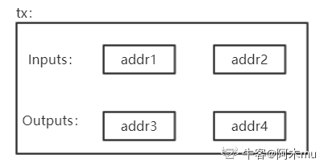
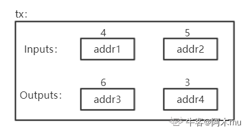

# 第十二讲：BTC 匿名性篇 1(匿名性分析)

::: info 说明

一般来说,匿名性多与隐私保护相关。但实际上，比特币中的匿名并非真正的匿名，而是假的匿名。实际上，比特币与纸币相比，纸币的匿名性更好，因为其并没有对个人信息的标记。也正是因为其匿名性，很多非法交易采用现金交易(银行风控系统了解一下？)。但现金存在保管、运输等各个方面的不便。

实际上，比特币中的数据是完全公开的，而网上的交易是要与实体世界进行交易的，所以大大破坏了其匿名性。假如银行允许用假名(以前的存折时代)，由于银行数据并非公开，所以银行系统的匿名性是要比比特币更好的。

:::

## BTC 系统中什么情况会破坏其匿名性？

### 1. 用户可以生成多个地址账户，但这些地址账户可以被关联起来
表面上看，每次交易可以更换公私钥对，从而每次都是新的账户，具有很强的匿名性。但实际上，这些账户在一定情况下，是可以被关联起来的。

例如下图，针对这样一个交易：

在图中可以看到该交易有 2 个输入和两个输出，所以 addr1 和 addr2 很可能是同一个人所持有的账户，因为该人同时拥有这两个私钥的地址。(一个账户中的钱可能不够)

而在输出中，很有可能有一个地址是属于找零钱的地址，即花掉之后剩余的钱。在某些情况下，也是可以分析出来的。

如上图，针对该交易，账户上面数字表示 BTC，可以指导 addr4 很明显是找零钱的地址，而非 addr3(支付 6 个比特币，单个账户不够用，所以用两个账户)。

### 2. 地址账户与个人在真实社会中的身份也可能会产生关联。
任何使得 BTC 和实体世界中关联的操作都有可能泄露用户真实身份，其中最明显的就是资金的转入转出。要得到 BTC，如果用钱买，就会与实体世界进行交互。想要将 BTC 转为现实中的货币，也同样需要与实体世界交互。

> 在很多国家，都有防洗钱法。如何防范不法分子采用 BTC 进行洗钱呢？其实很简单，只需要盯住资金转入转出链即可。对于大额资金转入 BTC 或将大量 BTC 转为现实货币，很难逃避司法金融机构的监管。

### 3. BTC 支付时候
例如某些商家接受用 BTC 进行支付，例如可以用 BTC 购买咖啡、蛋糕等。(这种场景信用卡已经解决的很好了，用 BTC 交易延迟高，交易费贵，并非一个好的 idea)
在进行支付时候，便和个人账户建立了联系，从而会泄露掉个人信息。

也就是说，BTC 并不是具有很好的匿名信。实际中，很多人保持有较好的匿名性。保持最好的便是其开发者中本聪，其参与 BTC 时间最长，全世界都想知道他是谁。但实际上，中本聪的比特币并非有花出去，这也使得我们难以发现他具体是谁。

> 以前美国有一个 skil road 网站，主要用于匿名支付，采用各类可以躲避监管的方法(因为售卖的都是违禁品)。但运行没有几年就被查封，其老板当时赚取了许多比特币，从纸面上看，已经实现了小目标(一个亿)。但由于其担心被发现，这些钱实际中一个都不敢花，在美国仍然过的是非常简朴的生活(《人民的名义》赵德汉："我一个都没敢花.")。最终据说由于在同一电脑上登录现实社会账户和非法网站上账户，从而被抓(具体原因未公开)。
> skil road 被查封后，有人开通了 skil road2，运行没有几年又被查封。

因此，可见互联网并非法外之地。如果想要干坏事，基本都能被查到。

## BTC 匿名性有多好？如何提高匿名性？

匿名的本质是不想要暴露身份。而对于普通人来说，BTC 的现有机制已经足够保持个人隐私了。但如果涉及违法，行政机关想要获得真实身份，其实很容易。
那么可以采取哪些方法尽可能提高匿名性？

> 从应用层看，可以将各个不同用户的 BTC 混合在一起，使得追查变得混乱(Coin mixing)；从网络层看，可以采用多路径转发的方法，数据不直接发送出去，而是经过很多跳(洋葱路由的基本思想)。

实际上，暴露用户隐私正是由于区块链的公开性和不可篡改性。不可篡改性对于隐私保护，实际上是灾难性的。 