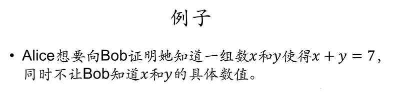
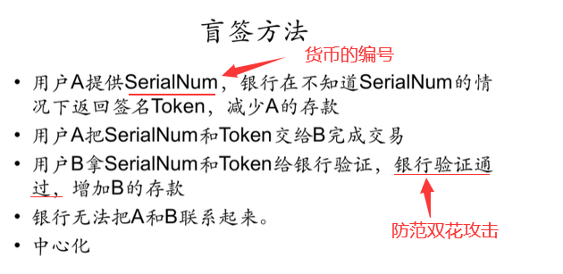

# BTC 匿名性篇 2(零知识证明)

## 零知识证明

**零知识证明：一方（证明者）向另一方（验证者）证明某一个陈述是正确的，但不需要透露除该陈述是正确的之外的任何信息。**

例如：A 想要向 B 证明某一账户属于 A，这说明 A 知道该账户的私钥。但不可能通过 A 公布私钥的方法来证明，该账户确实属于 A。因此，A 可以产生一个账户签名，B 通过公钥对签名进行验证。(实际上该证明是否属于零知识证明存在争议，因为泄露了用私钥产生的签名)

## 同态隐藏

零知识证明的数学基础便是同态隐藏。上图为同态隐藏的三个性质。

- 第一个性质，说明如果有 E(X)=E(y)，则必然有 x=y。(无碰撞)
- 第二个性质，说明加密函数不可逆。知道加密值，无法反推出密码值。
- 第三个性质，最为重要，称为同态运算。说明对加密后的函数值进行某些代数运算，等价于对输入直接进行代数运算再加密。

> 例子：

> 其中证明者为 Alice，验证者为 Bob。最简单的证明版本如下：
> 1.Alice 将 E(x)、E(y)发给 Bob。（性质 2，不可逆）
> 2.Bob 通过收到的 E(x)、E(y)计算得到 E(X+Y)。（性质 3，同态加法）
> 3.Bob 进行验证 E(x+y)和 E(7)是否相等。若相等则验证通过，否则验证失败。（性质 1，无碰撞）
> 缺陷：Bob 可以暴力获取 x 与 y 的值。

## 盲签

盲签名是一种特殊的数字签名技术。盲签名因签名的人看不到所签署文件的具体内容而闻名，它有两个显著的特点：一是签名者对消息的内容是不可见的 ;二是签名被公开后，签名者不能追踪签名。

> 为什么要这么做呢？
> 例如电子交易中，我们的交易信息依赖于银行等第三方机构。第三方机构需要防范双花攻击等，就需要对电子货币进行签名。而签名的过程中，必然会导致其了解到交易内容。如果想要银行等第三方机构负责相应工作，但不知道交易具体内容，就可以采用盲签的方法。

例如 A 向 B 转账。

> 既然了解到 BTC 提供了较好匿名性，但其无法完全消除关联性，那么如果想要这样一种货币怎么办？这就涉及了零币和零钞。

## 零币和零钞——专门为匿名性设计的货币

**零币和零钞**

- 零币和零钞在协议层就融合了匿名化处理，其匿名属性来自密码学保证。
- 零币(`zerocoin`)系统中存在基础币和零币，通过基础币和零币的来回转换，消除旧地址和新地址的关联性，其原理类似于混币服务。
- 零钞(`zerocash`)系统使用`zk-SNARKs`协议，不依赖一种基础币，区块链中只记录交易的存在性和矿工用来验证系统正常运行所需要关键属性的证明。区块链上既不显示交易地址也不显示交易金额，所有交易通过零知识验证的方式进行。

零币在花费的时候，只需要用零知识证明来证明所花掉的币是系统中存在的某一个合法的币，但不用透露具体花掉的是系统中哪一个币。这样就破坏了关联性。
当然，这类货币并非主流加密货币，因为其为了设计匿名性，付出了一定代价，而且，需要强匿名性的用户并不多。

从数学上看，零币和零钞是安全的。但其并不是百分之百的匿名，其并未解决与系统外部实体发生交互时对匿名性的破坏。 