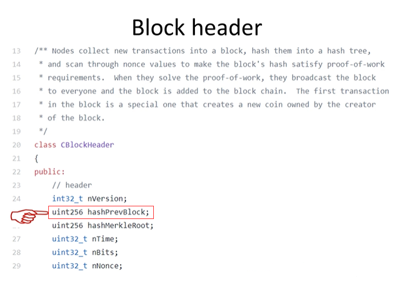

## 第十三讲：BTC 思考篇

### 哈希指针

BTC 系统中很多地方使用到了哈希指针。指针保存的本地内存地址，只有在本地计算机上才具有意义，如果发送给其他计算机就没有意义了。那么在区块发布时候，哈希指针如何通过网络进行传播？

> 所谓哈希指针，只是系统中一种形象化的方法。实际应用时候，只有哈希而没有指针。回顾之前提过的 Block header 数据结构：
>
> 
>
> 如图该处便为前一个区块的哈希值。

因此可见，在`block header`中只有 hash 值，没有指针。那么如何查找到前一个区块的内容？

全节点一般将区块存储于一个 key-value 数据库中，key 为哈希，value 为区块内容。常用的 key-value 数据库为 levelDB，只要掌握到最后一个区块的哈希值即可依据哈希值一直往前找到区块链所有内容。  
有些节点只保存区块链部分信息，如果需要用到前面的区块，可以问其他节点要。哈希指针性质保证了整个区块链内容是不可篡改的。

### 区块“恋”

有情侣一起买 BTC，将私钥从中截断，每人保留其中一部分。如果未来两人依旧感情很好，就可以将钱取出；如果分手，这部分钱就会永久锁死，谁也无法取出，通过区块链的不可篡改性作为两人的爱情见证。这样做有什么问题？
如此下来，N 个人怎么办？
如果按照这种方法，将私钥分为 N 份。但这样会有一系列问题。一. 如果 N 个人中任意一个人忘记私钥，则无法将钱取出。二.截断私钥长度，会降低安全性，因为私钥长度会直接影响破解难度(2^256 远远大于 2^128)，之间难度差距远远不止一倍。【可见，对于多个人账户，应该使用多重签名，而非截断私钥的方法。】三.如果分手，该钱变成死钱，一直保存在 UTXO 集合中，对矿工不友好。

### 分布式共识

之前有提及，理论上来说，分布式系统不可能达成共识。但实际中为何变成可能了？严格来说，BTC 系统\*\*\*识随时可能被推翻，例如分叉攻击导致系统回滚。
此外，理论和实际存在差异。不可能结论针对特定模型，实际中对模型稍微修改或添加线下方法即可将不可能变为可能。

**知识改变命运，这句话本身没有错，但是对知识的一知半解可能让你的命运变得更差，搞科研是很有意义的，但是不要给学术界的思维限制头脑，不要为程序员的思维限制想象力。**

### BTC 的稀缺性

为什么要挖矿？因为有收益，且收益大于开销。早期 BTC 难度低且出块奖励高，从而吸引矿工。  
之前有提到，BTC 总量固定，有人认为其是一个精妙的设计。但实际上，总量固定的东西并不适合作为货币，这也就决定了 BTC 并不能在未来完全颠覆现有货币体系。以太坊中便没有 BTC 中出块奖励定期减半的做法，此外，某些新型货币会自带通货膨胀的功能。  
对个人来说，通货膨胀并非好事，因为钱不值钱了。但人类每年创造的价值，如果用总量固定的东西作为货币，则其只会越来越值钱，而这会导致拥有者不断看着其升值，其他没有的人无论如何奋斗都赶不上（房市也是如此，炒房使一部分人靠房租便可大赚特赚，个人奋斗却很难买房。这也是我国目前存在的较大的问题，社会财富的分配不公，最终引发各种社会矛盾，需要政府解决）。

### 量子计算

会不会 BTC 这种建立在密码学上的加密货币，在量子计算出来后会不会变得不安全。

- 一. 量子计算距离使用仍然有很长距离（人工智能也是，目前仍然处于弱人工智能阶段。其实很多技术都是如此，炒的情况很严重，但距离实用很远。但是不炒便不会有资本流入进行研究，这也是一个非常相悖的地方）。
- 二. 量子计算若真正使用到破坏现有加密算法，对传统金融业的破坏仍然是最大的。
- 三. 实际中使用的并非公钥，而是可以用公钥哈希。而哈希函数一般都是不可逆的，所以即使量子计算也无法反推私钥。

BTC 中用的 SHA-256，无论输入多大，最终结果都为 256 位，必然会导致信息丢失，无法反推原本数据。

总结：

- 加密可逆、哈希不可逆；
- 加密不损失信息、哈希破坏信息（加密和哈希的区别）
