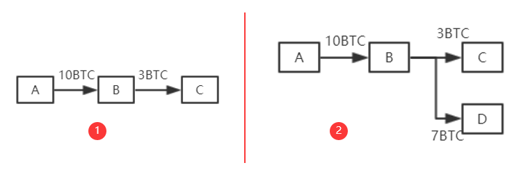

# 二、ETH 账户

> 以太坊采用基于账户的模型，与比特币的 UTXO 模型不同，更接近传统银行账户的概念。

## BTC vs ETH 账户模型对比

### BTC 系统（基于交易的账本）

BTC 系统是基于交易的账本，系统中并未显示记录账户有多少钱，只能通过 UTXO 进行推算。但实际中，使用起来较为别扭。A 转给 B 钱的时候，需要说明币的来源。实际中只需要存钱说明来源，花钱则不用。此外，账户中的钱在花的时候，必须一次性全部花出去

### 转账示例

如图 1，B 收到 A 的 10 个 BTC，他想要给 C 3 个 BTC，如果按照 1 中方式，其余 7 个比特币会以交易费的形式给挖出区块的矿工。  
因此，为了避免这种情况，便采用 2 中方式，将 3 个 BTC 转给 C，将剩余 7 个 BTC 转到自己的另一账户 D 上面。

## 以太坊账户模型

以太坊系统则采用了基于账户的模型，与现实中银行账户相似。系统中显示记录每个账户以太币的数量，转账是否合法只需要查看转账者账户中以太币是否足够即可，同时也不需要每次全部转账。同时，这也也天然地防范了双花攻击。

### 重放攻击问题

当然，以太坊这种模式也存在缺点，这种模式存在重放攻击的缺陷。A 向 B 转账，过一段时间，B 将 A 的交易重新发布，从而导致 A 账户被扣钱两次。

> **解决方案：** 为了防范重放攻击，给账户交易添加计数器记录该账户交易过多少次，转账时候将转账次数计入交易的内容中。
> 系统中全节点维护账户余额和该计数器的交易数，从而防止本地篡改余额或进行重放攻击。

## 账户类型

以太坊系统中存在两类账户：外部账户和合约账户。

### 1. 外部账户（EOA - Externally Owned Account）

类似于 BTC 系统中公私钥对。存在账户余额`balance`和计数器`nonce`

**特点：**

- 由私钥控制
- 可以主动发起交易
- 有余额和交易计数器

### 2. 合约账户（Contract Account）

并非通过公私钥对控制。(不能主动发起交易，只能接收到外部账户调用后才能发起交易或调用其他合约账户)其除了`balance`和`nonce`之外还有`code`(代码)、`storage`(相关状态-存储)

**特点：**

- 由代码控制
- 不能主动发起交易
- 有余额、交易计数器、代码和存储

创建合约时候会返回一个地址，就可以对其调用。调用过程中，代码不变但状态会发生改变。

## 为什么要采用基于账户的模型？

比特币中支持每次更换账户，但以太坊是为了支持智能合约，而合约签订双方是需要明确且较少变化的。尤其是对于合约账户来说，需要保持稳定状态。

## 账户模型对比总结

| 特性     | BTC (UTXO 模型)            | ETH (账户模型)         |
| -------- | -------------------------- | ---------------------- |
| 账户概念 | 无显式账户，通过 UTXO 推算 | 显式账户，直接记录余额 |
| 转账方式 | 必须说明币的来源           | 只需检查余额是否足够   |
| 转账限制 | 必须一次性全部花出         | 可以部分转账           |
| 重放攻击 | 天然防范                   | 需要 nonce 计数器防范  |
| 适用场景 | 货币应用                   | 平台应用，支持智能合约 |
