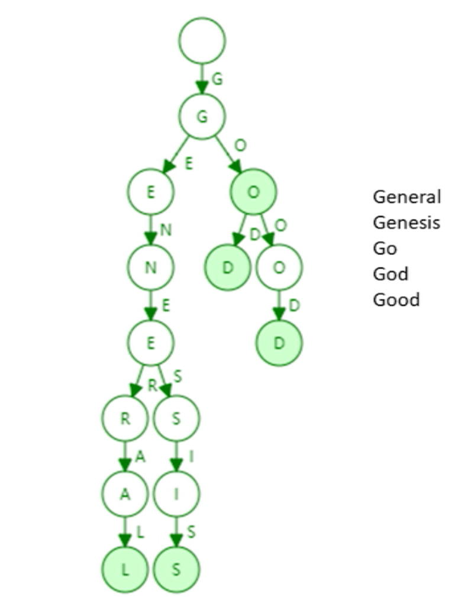
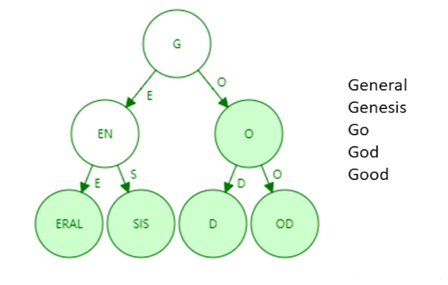

# 三、ETH 数据结构篇 1(状态树 1)

> 在以太坊中，有三棵树的说法，分别是状态树、收据树和交易树。了解了这三棵树，就弄清楚了以太坊的基础数据结构设计。

## 概述

前一篇文章中有提过，以太坊采用基于账户的模式，系统中显式记录每个账户的余额。而以太坊这样一个大型分布式系统中，是采用的什么样的数据结构来实现对这些数据的管理的。

## 引入

首先，我们要实现从账户地址到账户状态的映射。在以太坊中，账户地址为 160 字节，表示为 40 个 16 进制数额。状态包含了余额(`balance`)、交易次数(`nonce`),合约账户中还包含了 code(代码)、存储(stroge)。

- 直观地来看，其本质上为`Key-value`键值对，所以直观想法便用哈希表实现。若不考虑哈希碰撞，查询直接为常数级别的查询效率。
  但采用哈希表，难以提供`Merkle proof`(BTC 数据结构篇中有对`Merkle proof`的介绍，还记得是什么吗？)。

> **重要概念：** 需要记住的是，在 BTC 和以太坊中，交易保存在区块内部，一个区块可以包含多个交易。通过区块构成区块链，而非交易。

## 思考如何组织账户的数据结构

### 方案 1：哈希表 + Merkle Tree

我们能否像 BTC 中，将哈希表的内容组织为`Merkle Tree`？

**问题：** 但当新区块发布，哈希表内容会改变，再次将其组织为新的`Merkle Tree`?如果这样，每当产生新区块(ETH 中新区块产生时间为 10s 左右)，都要重新组织`Merkle Tree`，很明显这是不现实的。

**分析：** 需要注意的是，比特币系统中没有账户概念，交易由区块管理，而区块包含上限为 4000 个交易左右，所以`Merkle Tree`不是无限增大的。而`ETH中`，`Merkle Tree`来组织账户信息，很明显其会越来越庞大。

实际中，发生变化的仅仅为很少一部分数据，我们每次重新构建`Merkle Tree`代价很大

### 方案 2：直接使用 Merkle Tree

那我们不要哈希表了，直接使用`Merkle Tree`，每次修改只需要修改其中一部分即可，这个可以吗？

**问题：** 实际中，`Merkle Tree`并未提供一个高效的查找和更新的方案。此外，将所有账户构建为一个大的`Merkle Tree`，为了保证所有节点的一致性和查找速度，必须进行排序。

### 方案 3：Sorted Merkle Tree

那么经过排序，使用`Sorted Merkle Tree`可以吗？

**问题：** 新增账户，由于其地址随机，插入`Merkle Tree`时候很大可能在`Tree`中间，发现其必须进行重构。所以`Sorted Merkle Tree`插入、删除(实际上可以不删除)的代价太大。

### 最终方案：MPT

既然哈希表和`Merkle Tree`都不可以，那么我们看一下实际中以太坊采取的数据结构：`MPT`。

> **注意：** BTC 系统中，虽然每个节点构建的 Merkle Tree 不一致（不排序），但最终是获得记账权的节点的 Merkle Tree 才是有效的。

## 一个简单的数据结构——trie(字典树、前缀树)

如下为一个通过 5 个单词组成的 trie 数据结构（只画出 key，未画出 value）

### 特点：

1. **分支数目**：trie 中每个节点的分支数目取决于 Key 值中每个元素的取值范围(图例中最多 26 个英文字母分叉+一个结束标志位)。
2. **查找效率**：trie 查找效率取决于 key 的长度。实际应用中（以太坊地址长度为 160byte）。
3. **无碰撞**：理论上哈希会出现碰撞，而 trie 上面不会发生碰撞。
4. **确定性**：给定输入，无论如何顺序插入，构造的 trie 都是一样的。
5. **局部性**：更新操作局部性较好

### 缺点：

trie 的存储浪费。很多节点只存储一个 key，但其"儿子"只有一个，过于浪费。因此，为了解决这一问题，我们引入**Patricia tree/trie**

## 🔧 Patricia trie(Patricia tree)

`Patricia trie`就是进行了路径压缩的`trie`。如上图例子，进行路径压缩后如下图所示：

### 路径压缩效果

需要注意的是，如果新插入单词，原本压缩的路径可能需要扩展开来。那么，需要考虑什么情况下路径压缩效果较好？树中插入的键值分布较为稀疏的情况下，可见路径压缩效果较好。

在以太坊系统中，160 位的地址存在 2^160 种，该数实际上已经非常大了，和账户数目相比，可以认为地址这一键值非常稀疏。

**因此，我们可以在以太坊账户管理种使用 Patricia tree 这一数据结构！但实际上，在以太坊种使用的并非简单的 PT(Patricia tree),而是 MPT(Merkle Patricia tree)。**

关于 MPT 的内容，我们将在下一篇以太坊数据结构篇 1——状态树 2 中进行介绍。

## 总结

| 数据结构           | 优点               | 缺点                  | 适用性 |
| ------------------ | ------------------ | --------------------- | ------ |
| 哈希表             | 查询效率高         | 难以提供 Merkle proof | 不适用 |
| Merkle Tree        | 提供 Merkle proof  | 更新效率低            | 不适用 |
| Sorted Merkle Tree | 有序，查找效率高   | 插入删除代价大        | 不适用 |
| Patricia Tree      | 路径压缩，节省空间 | 需要进一步改进        | 适用   |
