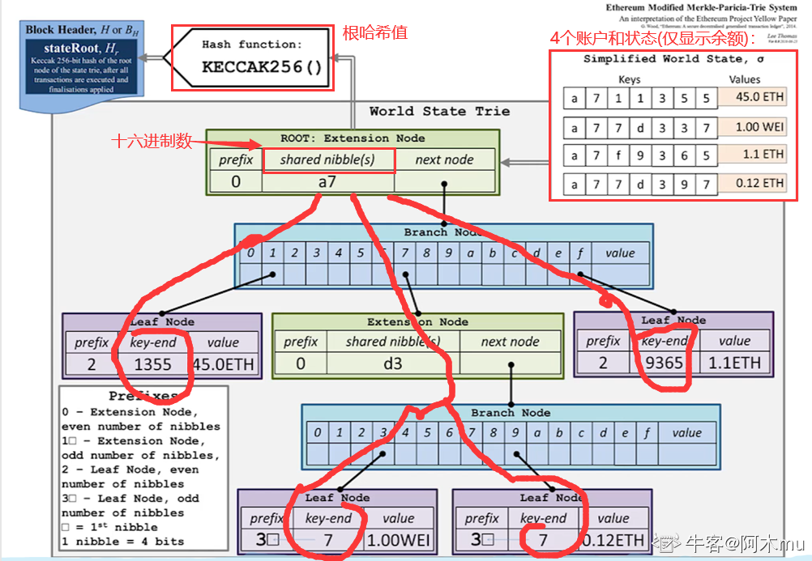
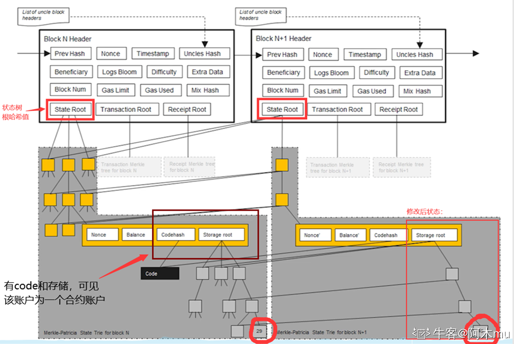
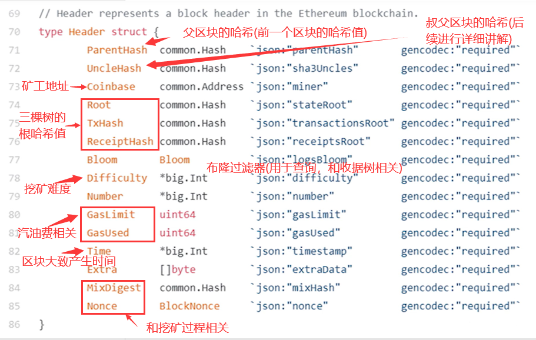
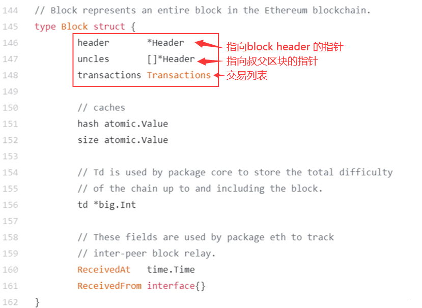
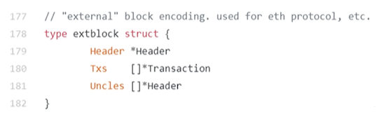

# 四、ETH 数据结构篇 2(状态树 2)

> MPT(Merkle Patricia Tree)是以太坊状态树的核心数据结构，结合了 Merkle Tree 的安全性和 Patricia Tree 的效率。

## Merkle Tree 和 Balance Tree

区块链和链表的区别在于区块链使用普通指针，链表使用哈希指针。
同样，`Merkle Tree` 相比 `Balance Tree`，也是普通指针换成了哈希指针。

所以，以太坊系统中可如此，将所有账户组织为一个经过路径压缩和排序的 Merkle Tree，其根哈希值存储于 block header 中。

> **重要概念：** BTC 系统中只有一个交易组成的 Merkle Tree，而以太坊中有三个(三棵树)。
> 也就是说，在以太坊的 block header 中，存在有三个根哈希值。

## 根哈希值的用处

1. **防止篡改**：通过哈希指针确保数据完整性
2. **提供 Merkle proof**：可以证明账户余额，轻节点可以进行验证
3. **证明账户存在**：证明某个发生了交易的账户是否存在

## MPT(`Modified Patricia tree`)

> 以太坊中针对 MPT(Merkle Patricia tree)进行了修改，我们称其为 MPT(Modified Patricia tree)

下图为以太坊中使用的 MPT 结构示意图。右上角表示四个账户(为直观，显示较少)和其状态(只显示账户余额)。（需要注意这里的指针都是哈希指针）

## 状态更新机制

每次发布新区块，状态树中部分节点状态会改变。但改变并非在原地修改，而是新建一些分支，保留原本状态。如下图中，仅仅有新发生改变的节点才需要修改，其他未修改节点直接指向前一个区块中的对应节点。

所以，系统中全节点并非维护一棵 MPT，而是每次发布新区块都要新建 MPT。只不过大部分节点共享。

> **为什么要保存原本状态？为何不直接修改？**
> 为了便于回滚。如下 1 中产生分叉，而后上面节点胜出，变为 2 中状态。那么，下面节点中状态的修改便需要进行回滚。因此，需要维护这些历史记录。
>
> 

## 通过代码看以太坊中的数据结构

### 1. `block header` 中的数据结构

### 2. 区块结构

### 3. 区块在网上真正发布时的信息

## 重要说明

状态树中保存 Key-value 对，key 就是地址，而 value 状态通过 RLP(`Recursive Length Prefix`，一种进行序列化的方法)编码序列号之后再进行存储。

## MPT 的优势

| 特性       | 说明                          |
| ---------- | ----------------------------- |
| **安全性** | 通过哈希指针提供 Merkle proof |
| **效率**   | 路径压缩减少存储空间          |
| **更新**   | 局部更新，不影响其他节点      |
| **历史**   | 保留历史状态，支持回滚        |
| **验证**   | 轻节点可以验证账户状态        |

## 三棵树对比

| 树类型     | 内容         | 特点               | 用途         |
| ---------- | ------------ | ------------------ | ------------ |
| **状态树** | 所有账户状态 | 全局状态，共享节点 | 账户余额查询 |
| **交易树** | 当前区块交易 | 区块独立           | 交易验证     |
| **收据树** | 交易执行结果 | 区块独立           | 复杂查询     |
