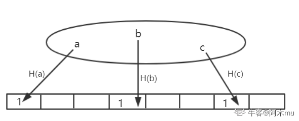
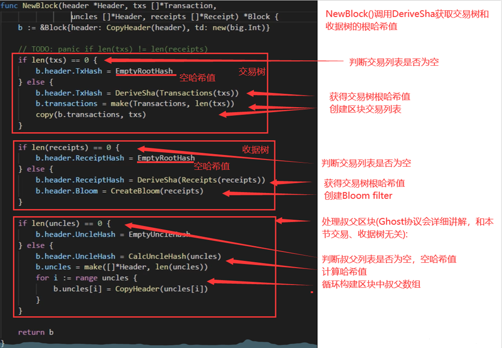

# 五、ETH 数据结构篇 3(交易树和收据树)

> 交易树和收据树是以太坊三棵树的重要组成部分，为轻节点提供 Merkle proof，支持复杂的查询操作。

## 交易树和收据树

每次发布一个区块时，区块中的交易会形成一颗 Merkle Tree，即交易树。此外，以太坊还添加了一个收据树，每个交易执行完之后形成一个收据，记录交易相关信息。也就是说，交易树和收据树上的节点是一一对应的。

由于以太坊智能合约执行较为复杂，通过增加收据树，便于快速查询执行结果。

## 数据结构特点

交易树和收据树都是 M(Merkle)PT，而 BTC 中都采用普通的 MT(Merkle Tree)。（可能就仅仅是为了三棵树代码复用好所以这样设计的）

MPT 的好处是支持查找操作，通过键值沿着树进行查找即可。对于状态树，查找键值为账户地址；对于交易树和收据树，查找键值为交易在发布的区块中的序号。

## 树的作用范围

交易树和收据树只将当前区块中的交易组织起来，而状态树将所有账户的状态都包含进去，无论这些账户是否与当前区块中交易有关系。

多个区块状态树共享节点，而交易树和收据树依照区块独立。

## 交易树和收据树的用途

1. **向轻节点提供 Merkle Proof**
2. **更加复杂的查找操作**（例如：查找过去十天的交易；过去十天的众筹事件等）

## Bloom filter(布隆过滤器)

支持较为高效查找某个元素是否在某个集合中

### 最笨方法

元素遍历，复杂度为 O(n)——轻节点不能用

### 布隆过滤器方法

给一个大的集合，计算出一个紧凑的"摘要"

> **例：** 如下图，给定一个数据集，其中含义元素 a、b、c，通过一个哈希函数 H()对其进行计算，将其映射到一个其初始全为 0 的 128 位的向量的某个位置，将该位置置为 1。将所有元素处理完，就可以得到一个向量，则称该向量为原集合的"摘要"。可见该"摘要"比原集合是要小很多的。
> 假定想要查询一个元素 d 是否在集合中，假设 H(d)映射到向量中的位置处为 0，说明 d 一定不在集合中；假设 H(d)映射到向量中的位置处为 1，有可能集合中确实有 d，也有可能因为哈希碰撞产生误报。
>
> 

### Bloom filter 特点

- **有可能出现误报，但不会出现漏报**
- **变种**：采用一组哈希函数进行向量映射，有效避免哈希碰撞

### 删除操作

如果集合中删除元素该怎么操作？
**无法操作**。也就是说，简单的 Bloom filter 不支持删除操作。如果想要支持删除操作，需要将记录数不能为 0 和 1，需要修改为一个计数器(需要考虑计数器是否会溢出)。

## 以太坊中 Bloom filter 的作用

每个交易完成后会产生一个收据，收据包含一个`Bloom filter`记录交易类型、地址等信息。在区块`block header`中也包含一个`Bloom filter`，其为该区块中所有交易的`Bloom filter`的一个并集。

所以，查找时候先查找块头中的`Bloom filter`，如果块头中包含。再查看区块中包含的交易的`Bloom filter`，如果存在，再查看交易进行确认；如果不存在，则说明发生了"碰撞"。

**好处：** 通过`Bloom filter`这样一个结构，快速大量过滤掉大量无关区块，从而提高了查找效率。

## 补充：交易驱动的状态机

以太坊的运行过程，可以视为**交易驱动的状态机**，通过执行当前区块中包含的交易，驱动系统从当前状态转移到下一状态。当然，BTC 我们也可以视为交易驱动的状态机，其状态为 UTXO。

对于给定的当前状态和给定一组交易，可以确定性的转移到下一状态(保证系统一致性)。

## 常见问题

### 问题 1：A 转账到 B，有没有可能收款账户不包含再状态树中？

**可能。** 因为以太坊中账户可以节点自己产生，只有在产生交易时才会被系统知道。

### 问题 2：可否将每个区块中状态树更改为只包含和区块中交易相关的账户状态？(大幅削减状态树大小，且和交易树、收据树保持一致)

**不能。** 首先，这样设计要查找账户状态很不方便，因为不存在某个区块包含所有状态。其次，如果要向一个新创建账户转账，因为需要知道收款账户的状态，才能给其添加金额，但由于其是新创建的账户，所有需要一直找到创世纪块才能知道该账户为新建账户，系统中并未存储，而区块链是不断延长的。

## 代码中具体数据结构

### 交易树和收据树的创建过程

> 根据此大致 demo 可以看到其创建流程。在肖老师视频中，还有针对 bloom filter 等具体结构的分析，这里不赘述，感兴趣可以直接观看肖老师视频。代码分析从该视频 29：00 开始，直接点击本篇最上方链接即可直接到达。
>
> 

## 三棵树总结对比

| 特性         | 状态树       | 交易树       | 收据树       |
| ------------ | ------------ | ------------ | ------------ |
| **数据结构** | MPT          | MPT          | MPT          |
| **作用范围** | 全局账户状态 | 当前区块交易 | 当前区块收据 |
| **节点共享** | 多区块共享   | 区块独立     | 区块独立     |
| **查找键值** | 账户地址     | 交易序号     | 交易序号     |
| **主要用途** | 账户状态查询 | 交易验证     | 复杂查询     |
