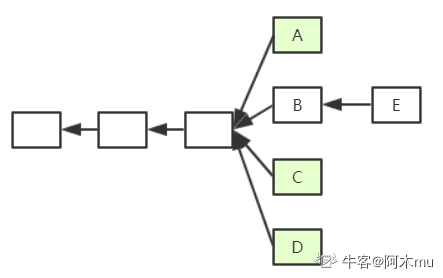
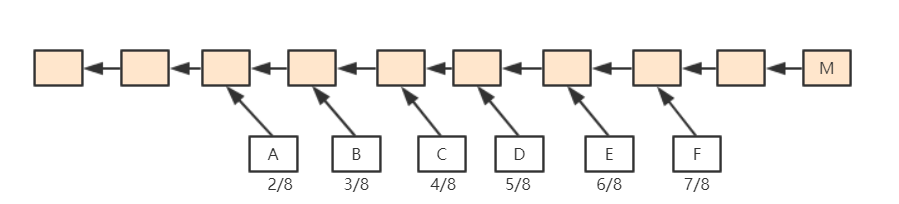
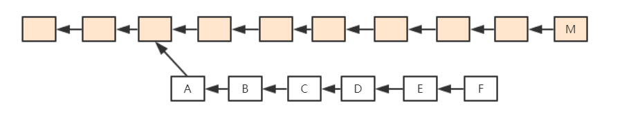
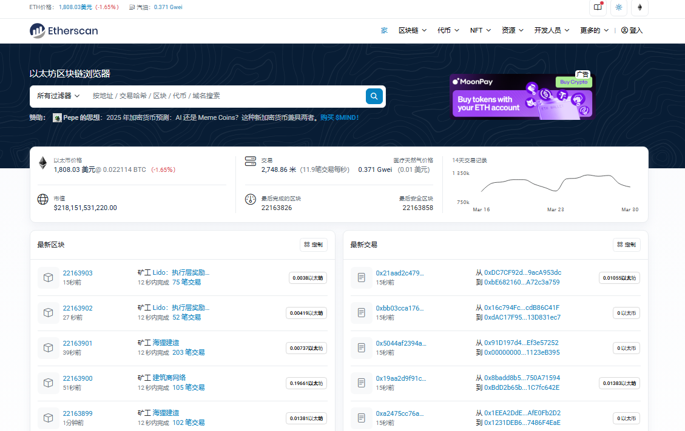

# 六、ETH 中 GHOST 协议篇

> GHOST 协议是以太坊为了解决快速出块导致的分叉问题而设计的共识协议，通过叔父区块机制来补偿被废弃的区块。

## 背景问题

BTC 系统中出块时间为 10min，而以太坊中出块时间被降低到 15s 左右，虽然有效提高了系统反应时间和吞吐率，却也导致系统临时性分叉变成常态，且分叉数目更多。这对于共识协议来说，就存在很大挑战。

在 BTC 系统中，不在最长合法链上的节点最后都是作废的，但如果在以太坊系统中，如果这样处理，由于系统中经常性会出现分叉，则矿工挖到矿很大可能会被废弃，这会大大降低矿工挖矿积极性。而对于个人矿工来说，和大型矿池相比更是存在天然劣势。

对此，以太坊设计了新的共识协议——**`GHOST协议`**(该协议并非原创，而是对原本就有的`Ghost`协议进行了改进)。

## GHOST 协议

### GHOST 协议最初版本

如图，假定以太坊系统存在以下情况，A、B、C、D 在四个分支上，最后，随着时间推移 B 所在链成为最长合法链，因此 A、C、D 区块都作废，但为了补偿这些区块所属矿工所作的工作，给这些区块一些"补偿"，并称其为"`Uncle Block`"（叔父区块）。

规定 E 区块在发布时可以将 A、C、D 叔父区块包含进来，A、C、D 叔父区块可以得到出块奖励的 7/8，而为了激励 E 包含叔父区块，规定 E 每包含一个叔父区块可以额外得到 1/32 的出块奖励。为了防止 E 大量包含叔父区块，规定一个区块只能最多包含两个叔父区块，因此 E 在 A、C、D 中最多只能包含两个区块作为自己的出块奖励

> **矿工策略：** 假定一个矿工挖出了 B，此时他沿着其所在链继续挖，而他知道 A 是和自己"同辈"，则可以将 A 包含进区块挖矿，若挖矿过程中又听到 C 也是"同辈"，则可以停止挖矿，将 C 包含进来重新组织成一个新区块重新挖矿，实际中，由于挖矿过程的`无记忆性`，这样并不会降低成功挖到矿的概率。

### 最初版本缺陷

1. **叔父区块数量限制**：因为叔父区块最多只能包含两个，如图出现 3 个怎么办？
2. **矿工自私行为**：矿工自私，故意不包含叔父区块，导致叔父区块 7/8 出块奖励没了，而自己仅仅损失 1/32。如果甲、乙两个大型矿池存在竞争关系，那么他们可以采用故意不包含对方的叔父区块，因为这样对自己损失小而对对方损失大。

## Ghost 协议新的版本

如下图中 1 为对上面例子的补充，F 为 E 后面一个新的区块。因为规定 E 最多只能包含两个叔父区块，所以假定 E 包含了 C 和 D。此时，F 也可以将 A 认为自己的的叔父区块(实际上并非叔父辈的，而是爷爷辈的)。如果继续往下挖，F 后的新区块仍然可以包含 B 同辈的区块(假定 E、F 未包含完)。这样，就有效地解决了上面提到的最初 Ghost 协议版本存在的缺陷。

但这样仍然存在一定的问题。
我们将"叔父"这个概念进行了扩展，但问题在于，**"叔父"这一定义隔多少代才好呢？**

## 叔父区块的定义

如下图所示，M 为该区块链上一个区块，F 为其严格意义上的叔父，E 为其严格意义上的"爷爷辈"。以太坊中规定：

- 如果 M 包含 F 辈区块，则 F 获得 7/8 出块奖励
- 如果 M 包含 E 辈区块，则 F 获得 6/8 出块奖励
- 以此类推向前，直到包含 A 辈区块，A 获得 2/8 出块奖励
- 再往前的"叔父区块"，对于 M 来说就不再认可其为 M 的"叔父"了

对于 M 来说，无论包含哪个辈分的"叔父"，得到的出块奖励都是 1/32 出块奖励。

也就是说，叔父区块的定义是和当前区块在七代之内有共同祖先才可（合法的叔父只有 6 辈）。

这样，就方便了全节点进行记录，此外，也从协议上鼓励一旦出现分叉马上进行合并。

## 以太坊中的奖励

| 系统    | 静态奖励                    | 动态奖励                             |
| ------- | --------------------------- | ------------------------------------ |
| **BTC** | 出块奖励                    | 交易费（占据比例很小）               |
| **ETH** | 出块奖励+包含叔父区块的奖励 | 汽油费（占据比例很小，叔父区块没有） |

**特殊说明：**

- BTC 中为了人为制造稀缺性，比特币每隔一段时间出块奖励会降低，最终当出块奖励趋于 0 后会主要依赖于交易费运作
- 而以太坊中并没有人为规定每隔一段时间降低出块奖励

## 关于叔父区块的疑问

### 要不要包含叔父区块中的交易？

**不应该。** 叔父区块和同辈的主链上区块有可能包含有冲突的交易。而且我们前文也提到，叔父区块是没有动态奖励的。因此，一个节点在收到一个叔父区块的时候，只检查区块合法性而不检查其中交易的合法性。

### 分叉后的堂哥区块怎么办？

例如下图所示，A->F 该链并非一个最长合法链，所以 B->F 这些区块怎么办？该给挖矿补偿吗？

如果规定将下面整条链作为一个整体，给予出块奖励，这一定程度上鼓励了分叉攻击(降低了分叉攻击的成本，因为即使攻击失败也有奖励获得)。因此，ETH 系统中规定，只认可 A 区块为叔父区块，给予其补偿，而其后的区块全部作废。

## 以太坊真实数据

> [Etherscan 网站](https://cn.etherscan.com/)

## GHOST 协议总结

| 特性         | 说明                                        |
| ------------ | ------------------------------------------- |
| **目的**     | 解决快速出块导致的分叉问题                  |
| **核心机制** | 叔父区块补偿机制                            |
| **奖励分配** | 叔父区块获得 7/8 奖励，包含者获得 1/32 奖励 |
| **包含限制** | 每个区块最多包含 2 个叔父区块               |
| **代际限制** | 最多 6 代叔父区块                           |
| **效果**     | 提高矿工积极性，减少分叉攻击                |
