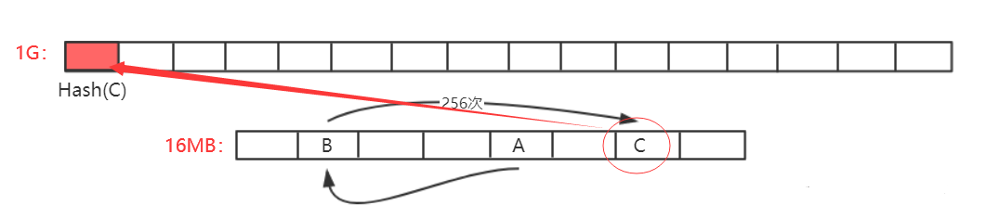

# 七、ETH 挖矿算法篇

> 以太坊采用 Memory Hard Mining Puzzle 设计，通过增加内存访问需求来实现 ASIC 抗性，让普通计算机也能参与挖矿。

## 概述

在之前的 BTC 篇中，介绍了比特币系统中使用的挖矿算法。挖矿这一过程，虽然并没有创造什么实际价值，但挖矿本身维持了比特币系统的稳定。总体来说，比特币系统中的挖矿算法较为成功，并未发现大的漏洞。

当然，比特币系统的挖矿算法也存在一定问题，其中最为突出的就是导致了挖矿设备的专业化，普通计算机用户难以参与进去，导致了挖矿中心化的局面产生，而这与"去中心化"这一理念相违背。

因此，在比特币之后包括以太坊在内的许多加密货币针对该缺陷进行改进，希图做到 ASIC Resistance(抗拒 ASIC 专用矿机)。由于 ASIC 芯片相对普通计算机来说，算力强但访问内存性能差距不大，因此常用的方法为 Memory Hard Mining Puzzle，即增加对内存访问的需求。

## 🪙 LiteCoin(莱特币)

> 莱特币中国官网：[https://litecoin.org/cn/](https://litecoin.org/cn/)

莱特币曾一度成为市值仅次于比特币的第二大货币。其基本设计大体上和比特币一致，但针对挖矿算法进行了修改。  
莱特币的`puzzle`基于`Scrypt`。`Scrypt`为一个对内存性能要求较高的哈希函数，之前多用于计算机安全密码学领域。

### 莱特币挖矿算法基本思想

#### 1. 设置大数组

设置一个很大的数组，按照顺序填充伪随机数。

> 因为哈希函数的输出我们并不能提前预料，所以看上去就像是一大堆随机的数据，因此称其为"伪随机数"。

`Seed`为种子节点，通过 Seed 进行一些运算获得第一个数，之后每个数字都是通过前一个位置的值取哈希得到的。
可以看到，这样的数组中取值存在前后依赖关系


#### 2. 伪随机读取

在需要求解`Puzzle`的时候，按照伪随机顺序，从数组中读取一些数，每次读取位置与前一个数相关。例如：第一次，从 A 位置读取其中数据，根据 A 中数据计算获得下一次读取位置 B；第二次,从 B 位置读取其中数据，根据 B 中数据计算获得下一次读取位置 C；


### 分析

如果数组足够大，对于挖矿矿工来说，必须保存该数组以便查询，否则每次不仅计算位置，还要根据 Seed 计算整个数组数据，才能查询到对应位置的数据。这对于矿工来说，计算复杂度大幅度上升。

当然，矿工可以选择只保存一部分数据，例如：只保存奇数位置数据，偶数位置需要时再根据前一个奇数位置数据计算即可，从而对内存空间大小减少了一半(计算复杂度提高一点，但内存减少一半)。

> **核心思想：** 不能仅仅进行运算，增加其对内存的访问，从而实现对 ASIC 芯片不友好。

### 莱特币设计的问题

这个 IDEA 有问题吗？看似蛮不错的，使得 ASIC 矿机挖矿变得不友好，但该方法对 Puzzle 验证并不是很友好。想要验证该 Puzzle，也需要存储该数组，因此对于轻节点来说，并不友好(系统中绝大多数节点为轻节点)。

因此，莱特币真正应用来说，数组大小不敢设置太大。例如：对于计算机而言，1G 毫无压力，而对于手机 APP 来说，1G 占据空间就过大了。所以，实际中，莱特币系统设计的数组大小仅仅 128K 大小。起初莱特币发行时，不仅希望能够抗拒 ASIC，还希望能抗拒 GPU。但实际中，后来慢慢出现了 GPU 挖矿，再后来，ASIC 芯片挖矿也出现了。实际应用中，莱特币的设计并未起到预期作用，也就是说，128k 对于`ASIC Resistance`来说过小了。

> **莱特币的这一设计是好事还是坏事？**
>
> 从其并未起到预期作用来看，当然是一件坏事，但换个角度来思考，早期通过宣传这一设计目标，有效吸引了大批矿工参与，解决了莱特币"能启动"问题，因此目前莱特币仍然是一个较为主流的加密货币。

此外，莱特币和比特币另一区别为出块时间，莱特币为 2.5min，为比特币的 1/4。除了这些不同外，这两种货币基本一样。

## 以太坊

以太坊的理念与莱特币相同，都是`Memory Hard Mining Puzzle`，但具体设计上与莱特币不同。

### 以太坊挖矿算法基本思想

以太坊中，设计了两个数据集，一大一小。小的为 16MB 的 cache，大的数据集为 1G 的 dataset(DAG)。其关系为，1G 的数据集是通过 16MB 数据集生成而来的。

> **思考为何要设计一大一小两个数据集？**
> 为了便于进行验证，轻节点保存 16MB 的 Cache 进行验证即可，而矿工为了挖矿更快，减少重复计算则需要存储 1GB 大小的大数据集。

### 16MB 的小 Cache 数据生成方式

16MB 的小 Cache 数据生成方式与莱特币中生成方式较为类似

1. 通过 Seed 进行一些运算获得第一个数，之后每个数字都是通过前一个位置的值取哈希获得的。
2. (不同)：

| 系统       | 读取方式                                                                                                           |
| ---------- | ------------------------------------------------------------------------------------------------------------------ |
| **莱特币** | 直接从数组中按照伪随机顺序读取一些数据进行运算                                                                     |
| **以太坊** | 先生成一个更大的数组(注：以太坊中这两个数组大小并不固定，因为考虑到计算机内存不断增大，因此该两个数组需要定期增大) |


### 大的 DAG 生成方式

大的数组中每个元素都是从小数组中按照伪随机顺序读取一些元素，方法同莱特币中相同。如第一次读取 A 位置数据，对当前哈希值更新迭代算出下一次读取位置 B，再进行哈希值更新迭代计算出 C 位置元素。如此来回迭代读取 256 次，最终算出一个数作为 DAG 中第一个元素，如此类推，DAG 中每个元素生成方式都依次类推。



### 分析

轻节点只保存小的 cache，验证时进行计算即可。但对于挖矿来说，如果这样则大部分算力都花费在了通过 Cache 计算 DAG 上面，因此，其必须保存大的数组 DAG 以便于更快挖矿。

> **以太坊挖矿过程：**
> 根据区块`block header`和其中的`Nonce`值计算一个初始哈希，根据其映射到某个初始位置 A，读取 A 位置的数及其相邻的后一个位置 A'上的数,根据该两个数进行运算，算得下一个位置 B，读取 B 和 B'位置上的数，依次类推，迭代读取 64 次，共读取 128 个数。
>
> 
>
> 最后，计算出一个哈希值与挖矿难度目标阈值比较，若不符合就重新更换 Nonce，重复以上操作直到最终计算哈希值符合难度要求或当前区块已经被挖出。

## 伪代码理解以太坊挖矿算法

### 1. 生成 16MB 大小的`Cache`

```python
def mkcache(cache_size, seed):
 o = [hash(seed)]
 for i in range(1, cache_size):
     o.append(hash(o[-1]))
 return o
```

这个函数是通过 seed 计算出来 cache 的伪代码。  
伪代码略去了原来代码中对 cache 元素进一步的处理，只展示原理，即 cache 中元素按序生成，每个元素产生时与上一个元素相关。  
每隔 30000 个块会重新生成 seed(对原来的 seed 求哈希值)，并且利用新的 seed 生成新的 cache。  
cache 的初始大小为 16M，每隔 30000 个块重新生成时增大初始大小的 1/128 ——128k 。

### 2. 通过 Cache 生成大数据集中第 i 个元素

伪代码省略了大部分细节，展示原理。

```python
def calc_dataset_item(cache, i):
 cache_size = len(cache)  # 使用 len() 函数获取列表长度
 mix = hash(cache[i % cache_size] ^ i)
 for j in range(256):
     cache_index = get_int_from_item(mix)  # 假设这是一个自定义函数
     mix = make_item(mix, cache[cache_index % cache_size])  # 假设这是一个自定义函数
 return hash(mix)
```

这是通过`cache`来生成`dataset`中第`i`个元素的伪代码。  
这个`dataset`叫作`DAG`，初始大小是 1G，也是每隔 30000 个块更新，同时增大初始大小的 1/128 —— 8M.
先通过 cache 中的第 `i% cache_size` 个元素生成初始的 mix,因为两个不同的`dataset`元素可能对应同一个`cache`中的元素，为了保证每个初始的`mix`都不同，注意到 i 也参与了哈希计算。
随后循环 256 次，每次通过`get int from item`来根据当前的`mix`值求得下一个要访问的`cache`元素的下标，用这个 cache 元素和 mix 通过`make_item`求得新的 mix 值。注意到由于初始的 mix 值都不同，所以访问`cache`的序列也都是不同的。  
最终返回`mix`的哈希值，得到第`i`个`dataset`中的元素。
多次调用这个函数，就可以得到完整的`dataset`。

### 3. 生成大数据集 DAG 中的每个元素

```python
def calc_dataset(full_size, cache):
 return [calc_dataset_item(cache, i) for i in range(full_size)]
```

这个函数通过不断调用前边介绍的`calc_dataset_item`函数来依次生成`dataset`中全部`full_size`个元素。

### 4. 矿工挖矿函数与轻节点验证函数


### 5. 矿工挖矿的主题循环


### 6. 所有函数的汇总


## 以太坊挖矿算法效果

目前以太坊挖矿以 GPU 为主，可见其设计较为成功，这与以太坊设计的挖矿算法(Ethash)所需要的大内存具有很大关系。  
1G 的大数组与 128k 相比，差距 8000 多倍，即使是 16MB 与 128K 相比，也大了一百多倍，可见对内存需求的差距很大(况且两个数组大小是会不断增长的)。

当然，以太坊实现`ASIC Resistance`除了挖矿算法设计之外，还存在另外一个原因，即其预期从**工作量证明(POW)**转向**权益证明(POS)**

## 权益证明(POS: Proof of State)

权益证明：按照所占权益投票进行共识达成，类似于股份制有限共识按照股份多少投票，权益证明不需要挖矿。  
而这对于 ASIC 矿机厂商来说，就好比一把悬在头上的达摩克利斯之剑。因为 ASIC 芯片研发周期很长，成本很高，如果以太坊转入权益证明，这些投入的研发费用将全部白费(ASIC 矿机只能用于挖特定的加密货币)

但实际上，以太坊目前仍然是 POW 挖矿共识机制。在设计之初，以太坊开发者就设想要从 POW 转向 POS，并为了防止有矿工不愿意转埋下了一颗"难度炸弹"。但截至目前，以太坊仍然基于 POW 共识机制。

> **其实很多时候，面对一些问题转换思路就能得到很好的解决方案。** 如这里，如果按照原本思想，通过不断改进挖矿算法来达成 ASIC Resistance，无疑是比较难的。而这里通过不停宣传要转向 POS 来不断吓阻矿工，使得矿工不敢擅自转入 ASIC 挖矿，从而实现了 ASIC Resistance。

## 预挖矿(Pre-Mining)

以太坊中采用的预挖矿的机制。这里"预挖矿"并不挖矿，而是在开发以太坊时，给开发者预留了一部分货币。以太坊的早期开发者，目前就很有钱了。（致富新思路！果然技术=Money 呀）

而比特币并未采用这一模式，所有比特币都是通过挖矿产生的。但早期挖矿难度容易，所有中本聪本人本来就有很多币(但没花....)

和`Pre-Mining`对应，还有`Pre-Sale`，`Pre-Sale`指的是将预留的货币出售掉用于后续开发，类似于拉风投或众筹。目前，各类加密货币很多，存在一部分货币就在采用 Pre-Sale 来获取资金，如果此时买入，后续如果该货币取得成功，同样可以获得很大收益，但真正成功的货币只占少数，这就是其风险性。

## 其他观点

上述挖矿算法设计一直趋向于让大众参与，这一才是公平的。且由于参与人员的分散，算力分散，也进一步使得系统更安全。

但同样一件事物，从不同观点看就有不同的看法。也有人认为让普通计算机参与挖矿是不安全的，像比特币那样，让中心化矿池参与挖矿才是安全的。为什么呢？

因为要攻击系统，需要购入大量只能进行特定货币挖矿的矿机通过算力进行强行 51%攻击，而攻击成功后，必然导致该币种的价值跳水，攻击者投入的硬件成本将会全部打水漂。而如果让通用计算机也参与挖矿，发动攻击成本便大幅度降低，目前的大型互联网公司，将其服务器聚集起来进行攻击即可，而攻击完成后这些服务器仍然可以转而运行日常业务。因此，也有人认为，在挖矿上面，ASIC 矿机"一统天下"才是最安全的方式。

## 总结

| 特性           | 莱特币   | 以太坊                 |
| -------------- | -------- | ---------------------- |
| **算法**       | Scrypt   | Ethash                 |
| **内存需求**   | 128K     | 1G (DAG) + 16M (Cache) |
| **ASIC 抗性**  | 效果有限 | 效果显著               |
| **验证友好性** | 一般     | 较好                   |
| **挖矿设备**   | GPU/ASIC | 主要是 GPU             |
