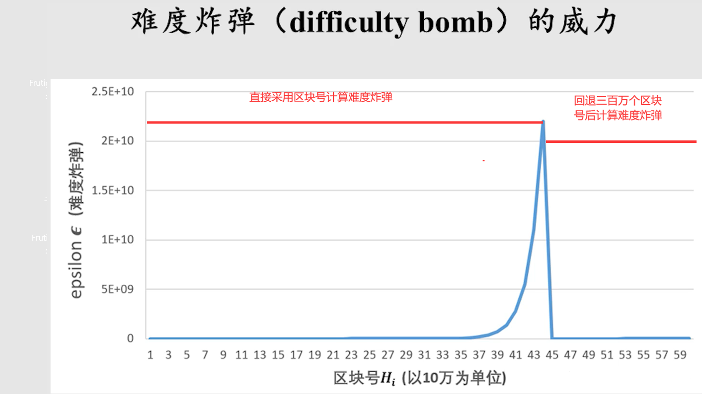
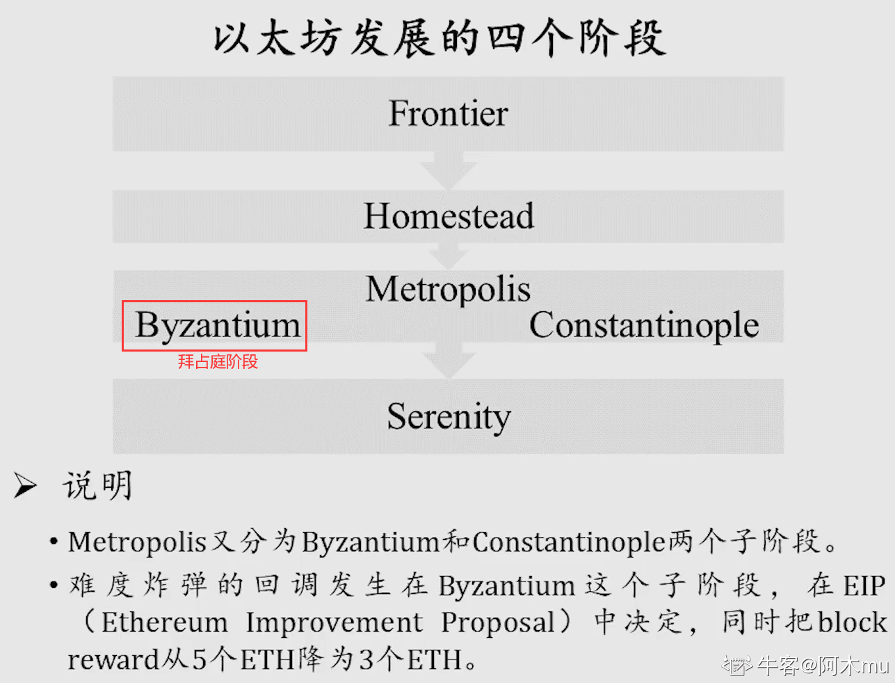
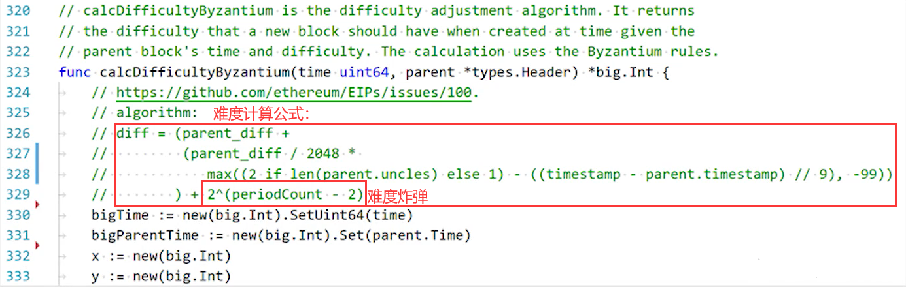
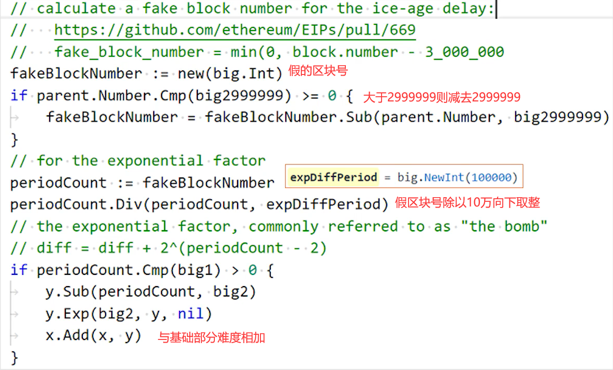

# 八、ETH 挖矿难度调整篇

> 以太坊每个区块都可能进行难度调整，相比比特币的 2016 个区块调整一次，以太坊的难度调整更加动态和复杂。

## 概述

前文中介绍了比特币难度调整是每隔 2016 个区块调整难度，从而达到维持出块时间 15min 的目标。而以太坊则与之不同，每个区块都又可能会进行难度调整。以太坊难度调整较为复杂，存在多个版本，网络上存在诸多不一致，这里遵循以代码逻辑为准的原则，从代码中查看以太坊难度调整算法。

## 以太坊难度调整

以太坊中区块难度调整算法如下图所示：

## 难度炸弹

### 为什么要设置难度炸弹？

根据以上以太坊难度调整算法可以看到，该算法可以很好地动态调整挖矿难度，从而保障系统整体出块时间维持在 15s 左右。但之前在挖矿算法的文章中有介绍到，以太坊在设计之初就计划要逐步从 POW（工作量证明）转向 POS（权益证明），而权益证明不需要挖矿。

从旁观者角度来看，挖矿消耗了大量电力、资金等，如果转入放弃挖矿，必然是一件好事。但从矿工的角度，花费了很大精力投入成本购买设备，突然被告知"不挖矿了"，这必然是一件很难接受的事情。而以太坊本身为一个分布式系统，其转入 POS 必须经过系统中大多数矿工认可才行，如果届时矿工联合起来转入 POS，那么这一设计初衷就成了一江流水。

因此，以太坊在设计之初便添加了难度炸弹，迫使矿工转入 POS。那么如何促使矿工自愿升级软件，而非坚持 POW 呢？

> **数学上，指数函数是一个很可怕的东西。** 我们谈论一个算法，无论其时间复杂度还是空间复杂度，只要达到了指数级别，这个算法必然难以应用于大规模计算上。指数函数在前期增长相对缓慢，但在后期呈现"指数爆炸"，而这往往是我们无法通过升级硬件所能解决的。

可以看到，在以太坊早期时，区块号较小，难度炸弹计算所得值较小，难度调整级别基本上通过难度调整中的自适应难度调整部分决定，而随着越来越多区块被挖出，难度炸弹的威力开始显露出来，这也就使得挖矿变得越来越难，从而迫使矿工愿意转入 POS。

## 难度炸弹调整

上面提到，以太坊设想是通过埋设难度炸弹迫使矿工届时愿意转入权益证明，但现实中有一句话："理想很丰满，现实很骨感"。在实际应用中，权益证明的方式仍然并不成熟，目前以太坊共识机制仍然是 POW，依然需要矿工参与挖矿维护以太坊系统的稳定。也就是说，转入 POS 的时间节点被一再推迟，虽然挖矿变得越来越难，系统出块时间开始逐渐变长，但矿工仍然需要继续挖矿。

在上面难度炸弹的公式中，有人应该注意到了第二项中的 fake block number，该数仅仅为对当前区块编号减去了三百万，也就是相当于将区块编号回退了三百万个。那么，在前三百万个区块的时候，这个`fake block number`就是负数吗？

答案是否定的。实际上，在以太坊最初的设计中，并没有第二个公式。也就是说，最初就是简单地直接用区块编号除以 100000。而在转入权益证明时间节点一再推迟后，以太坊系统采取了将区块编号回退三百万个区块的方法来降低挖矿难度，当然，为了保持公平，也将出块奖励从 5 个以太币减少到了 3 个以太币，这也是`fake block number`这一项出现的原因。

下图显示了难度调整对难度炸弹难度影响的结果：

## 以太坊发展

个人感觉这一块肖老师讲解得较为粗略，对于以太坊的四个阶段都只是简单提及，对"拜占庭"这一区块链中非常经典的问题并未进行介绍。可能是肖老师希望这些内容大家自行了解或是课程安排时间匆忙的缘故。

等写完肖老师整个区块链技术课程系列之后，如果大家对这块感兴趣，我会考虑查找资料写一下这些内容。在这里先占个坑。

### 拜占庭将军问题

### 区块链发展阶段介绍

以太坊发展存在四个阶段，我们目前处于第三个阶段中的拜占庭阶段，难度炸弹回调就是在拜占庭阶段进行的。

## 具体实现代码

### 1. 难度计算公式

`bigTime`为当前区块时间戳，`bigParentTime`为当前区块的父区块时间戳。

### 2. 基础部分计算

### 3. 难度炸弹计算

#### 为什么不是减去 3000000，而是 2999999？

因为这里判断的父区块号，而公式中是根据当前区块来算的。

## 以太坊实际统计数据(2018 年，取自肖老师授课 PPT)

### 1. 以太坊挖矿难度变化曲线

断崖式下跌是由于下调难度炸弹 300 万个区块。

### 2. 以太坊出块时间变化曲线图

### 3. 两个真实区块信息

`difficulty`为当前区块难度，`total difficulty`为当前区块链上所有区块难度相加。
可见，最长合法链也就等同于最难合法链（难度最大合法链）。

## 难度调整对比

| 特性         | BTC              | ETH                |
| ------------ | ---------------- | ------------------ |
| **调整频率** | 每 2016 个区块   | 每个区块都可能调整 |
| **调整目标** | 维持 10 分钟出块 | 维持 15 秒出块     |
| **调整算法** | 相对简单         | 复杂，包含多个组件 |
| **特殊机制** | 无               | 难度炸弹           |
| **调整范围** | 限制在 4 倍以内  | 无明确限制         |

## 难度调整组件分析

### 1. 基础难度调整

根据父区块难度和出块时间进行线性调整

### 2. 自适应难度调整

根据最近区块的出块时间动态调整

### 3. 难度炸弹

指数级增长的难度，用于推动 POS 转型

### 4. 叔父区块影响

包含叔父区块会影响难度计算

## 难度调整的意义

1. **维持稳定的出块时间**：确保系统吞吐量稳定
2. **防止算力波动影响**：当算力变化时自动调整
3. **推动技术升级**：通过难度炸弹推动 POS 转型
4. **保持网络安全性**：防止攻击者通过算力波动影响网络
