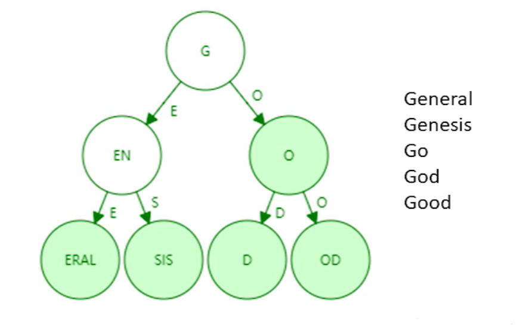
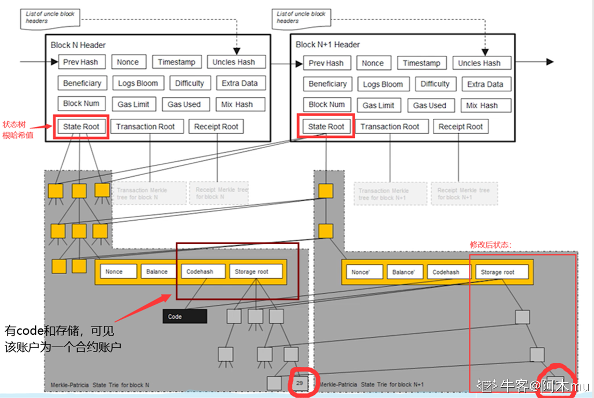
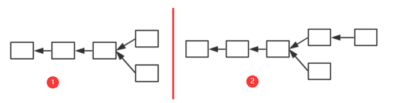
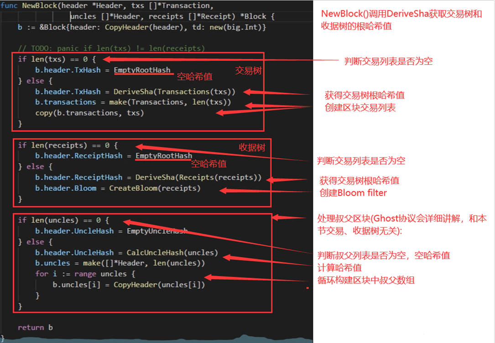
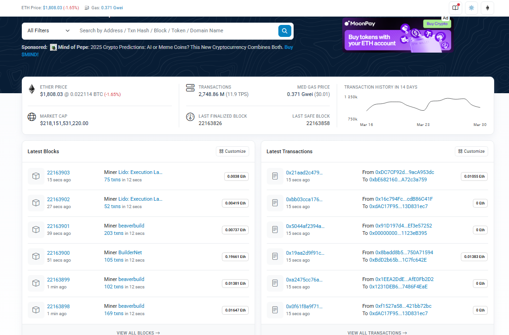
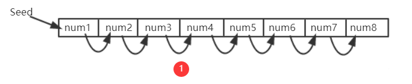
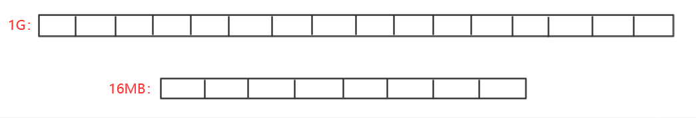
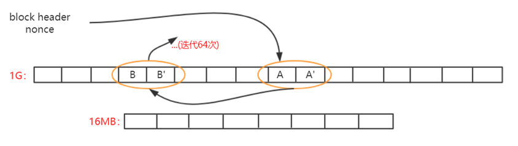
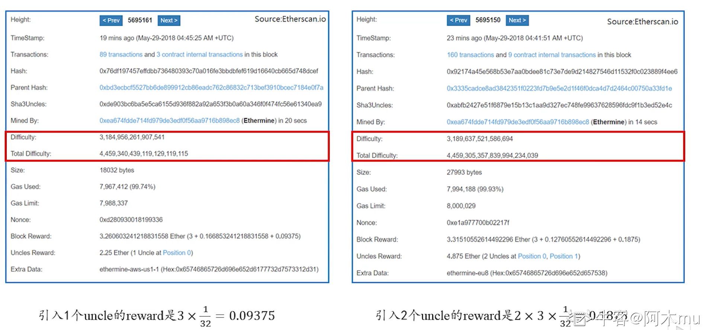
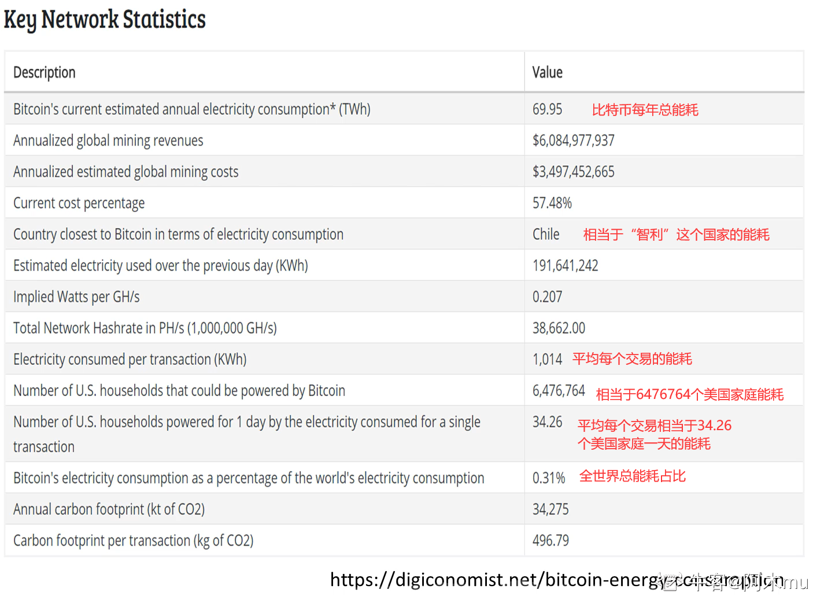

## 《区块链技术与应用》· Ethereum

### 课程概述

《区块链技术与应用》是北京大学的一节公开课，由肖臻老师讲授，主要讲解区块链的基本概念和实现原理，面向广大对区块链技术和应用感兴趣的同学。通过这门课的学习，能够了解与掌握比特币、以太坊区块链技术的基础知识。

**说明：** 以下笔记内容主要根据书本的内容、老师课程上讲述内容、阿木mu老师笔记参考、以及个人的理解和总结构成，并使用了 AI 进行润饰。

- [B 站肖臻老师](https://www.bilibili.com/video/BV1Vt411X7JF/?vd_source=7138dfc78c49f602f8d3ed8cfbf0513d)

- [阿木 mu](https://blog.nowcoder.net/n/30cbdb37108b4d93b3a5a93b8226ae31)

## 一、ETH 概述篇

- **概述**
  `BTC`和`ETH`为最主要的两种加密货币，BTC 称为区块链 1.0，以太坊称为区块链 2.0。之前文章中提出了比特币设计中存在某些不足，以太坊便对其进行了改进。例如：出块时间、共识协议、`mining puzzle`（对内存要求高，反 ASIC 芯片使用）
  未来，以太坊还将会用权益证明(POS)替代工作量证明(POW)
  此外，以太坊增加了对智能合约（`smart contract`）的支持。

### 为什么要弄“智能合约”

BTC 本身是一个去中心化的货币，在比特币取得成功之后，很多人就开始思考：除了货币可以去中心化，还有什么可以去中心化？以太坊的一个特性就是增加了对去中心化的合约的支持。  
如果说比特币系统本身是一个货币应用，以太坊则由于智能合约，升级成为了一个平台，用户可以依据该平台自行开发业务应用。

### 关于 BTC 和 ETH

`BTC`的发明人为中本聪(疑似日本人)，`ETH`为`Vitalik Buterin`收到`BTC`启发发明出来的““下一代加密货币与去中心化应用平台””。BTC 中货币最小单位为“聪”，最少的钱为一聪；ETH 中货币最小单位为“Wei”，最少的钱为一 Wei。

### 去中心化的合约

首先，讨论去中心化货币。货币本身由政府发行，政府公信力为其背书，BTC 通过技术手段取代了政府的职能。
现实生活中，我们经常提到“契约”或“合约”。合约的有效性也是需要政府进行维护的，如果产生，需要针对合法性合同进行判决。ETH 的设计目的就是，通过技术手段来实现取代政府对于合约的职能。
那么，去中心化的合约有什么好处？
若合同签署方并非一个国家，没有统一的司法部门（如：众筹）。如果可以编写无法修改的合约，所有人只能按照相关参与方执行，无法违约。

## 二、ETH 账户

BTC 系统是基于交易的账本，系统中并未显示记录账户有多少钱，只能通过 UTXO 进行推算。但实际中，使用起来较为别扭。
A 转给 B 钱的时候，需要说明币的来源。实际中只需要存钱说明来源，花钱则不用。此外，账户中的钱在花的时候，必须一次性全部花出去。

如图 1，B 收到 A 的 10 个 BTC，他想要给 C3 个 BTC，如果按照 1 中方式，其余 7 个比特币会以交易费的形式给挖出区块的矿工。  
因此，为了避免这种情况，便吸引采用 2 中方式，将 3 个 BTC 转给 C，将剩余 7 个 BTC 转到自己的另一账户 D 上面。


以太坊系统则采用了基于账户的模型，与现实中银行账户相似。系统中显示记录每个账户以太币的数量，转账是否合法只需要查看转账者账户中以太币是否足够即可，同时也不需要每次全部转账。同时，这也也天然地防范了双花攻击。
当然，以太坊发这种模式也存在缺点，这种模式存在重放攻击的缺陷。A 向 B 转账，过一段时间，B 将 A 的交易重新发布，从而导致 A 账户被扣钱两次。

> 为了防范重放攻击，给账户交易添加计数器记录该账户交易过多少次，转账时候将转账次数计入交易的内容中。
> 系统中全节点维护账户余额和该计数器的交易数，从而防止本地篡改余额或进行重放攻击。

以太坊系统中存在两类账户：外部账户和合约账户。

1. 外部账户：类似于 BTC 系统中公私钥对。存在账户余额`balance`和计数器`nonce`
2. 合约账户：并非通过公私钥对控制。(不能主动发起交易，只能接收到外部账户调用后才能发起交易或调用其他合约账户)其除了`balance`和`nonce`之外还有`code`(代码)、`storage`(相关状态-存储)  
   创建合约时候会返回一个地址，就可以对其调用。调用过程中，代码不变但状态会发生改变。

为什么要做以太坊，换基于账户的模型？  
比特币中支持每次更换账户，但以太坊是为了支持智能合约，而合约签订双方是需要明确且较少变化的。尤其是对于合约账户来说，需要保持稳定状态。

## 三、ETH 数据结构篇 1(状态树 1)

::: info

在以太坊中，有三棵树的说法，分别是状态树、收据树和交易树。了解了这三棵树，就弄清楚了以太坊的基础数据结构设计。
而以太坊实现的是一个"平台性"的应用，其复杂性必然较高。因此，其内部数据结构设计也存在一定复杂度。对此，ETH 数据结构篇将花费较多篇幅进行编写，请继续关注后续内容。

:::

前一篇文章中有提过，以太坊采用基于账户的模式，系统中显式记录每个账户的余额。而以太坊这样一个大型分布式系统中，是采用的什么样的数据结构来实现对这些数据的管理的。

### 引入

首先，我们要实现从账户地址到账户状态的映射。在以太坊中，账户地址为 160 字节，表示为 40 个 16 进制数额。状态包含了余额(`balance`)、交易次数(`nonce`),合约账户中还包含了 code(代码)、存储(stroge)。

- 直观地来看，其本质上为`Key-value`键值对，所以直观想法便用哈希表实现。若不考虑哈希碰撞，查询直接为常数级别的查询效率。
  但采用哈希表，难以提供`Merkle proof`(BTC 数据结构篇中有对`Merkle proof`的介绍，还记得是什么吗？)。

> 需要记住的是，在 BTC 和以太坊中，交易保存在区块内部，一个区块可以包含多个交易。通过区块构成区块链，而非交易。

### 思考如何组织账户的数据结构

1. 我们能否像 BTC 中，将哈希表的内容组织为`Merkle Tree`？
   但当新区块发布，哈希表内容会改变，再次将其组织为新的`Merkle Tree`?如果这样，每当产生新区块(ETH 中新区块产生时间为 10s 左右)，都要重新组织`Merkle Tree`，很明显这是不现实的。
   需要注意的是，比特币系统中没有账户概念，交易由区块管理，而区块包含上限为 4000 个交易左右，所以`Merkle Tree`不是无限增大的。而`ETH中`，`Merkle Tree`来组织账户信息，很明显其会越来越庞大。
   实际中，发生变化的仅仅为很少一部分数据，我们每次重新构建`Merkle Tree`代价很大
2. 那我们不要哈希表了，直接使用`Merkle Tree`，每次修改只需要修改其中一部分即可，这个可以吗？
   实际中，`Merkle Tree`并未提供一个高效的查找和更新的方案。此外，将所有账户构建为一个大的`Merkle Tree`，为了保证所有节点的一致性和查找速度，必须进行排序。
3. 那么经过排序，使用`Sorted Merkle Tree`可以吗？
   新增账户，由于其地址随机，插入`Merkle Tree`时候很大可能在`Tree`中间，发现其必须进行重构。所以`Sorted Merkle Tree`插入、删除(实际上可以不删除)的代价太大。
   既然哈希表和`Merkle Tree`都不可以，那么我们看一下实际中以太坊采取的数据结构：`MPT`。

> 注意：BTC 系统中，虽然每个节点构建的 Merkle Tree 不一致（不排序），但最终是获得记账权的节点的 Merkle Tree 才是有效的。

### 一个简单的数据结构——trie(字典树、前缀树)

如下为一个通过 5 个单词组成的 trie 数据结构（只画出 key，未画出 value）


#### 特点：

1. trie 中每个节点的分支数目取决于 Key 值中每个元素的取值范围(图例中最多 26 个英文字母分叉+一个结束标志位)。
2. trie 查找效率取决于 key 的长度。实际应用中（以太坊地址长度为 160byte）。
3. 理论上哈希会出现碰撞，而 trie 上面不会发生碰撞。
4. 给定输入，无论如何顺序插入，构造的 trie 都是一样的。
5. 更新操作局部性较好
   那么 trie 有缺点吗？当然有：
   trie 的存储浪费。很多节点只存储一个 key，但其“儿子”只有一个，过于浪费。因此，为了解决这一问题，我们引入**Patricia tree/trie**

### Patricia trie(Patricia tree)

`Patricia trie`就是进行了路径压缩的`trie`。如上图例子，进行路径压缩后如下图所示：



需要注意的是，如果新插入单词，原本压缩的路径可能需要扩展开来。那么，需要考虑什么情况下路径压缩效果较好？树中插入的键值分布较为稀疏的情况下，可见路径压缩效果较好。
在以太坊系统中，160 位的地址存在 2^160 种，该数实际上已经非常大了，和账户数目相比，可以认为地址这一键值非常稀疏。  
**因此，我们可以在以太坊账户管理种使用 Patricia tree 这一数据结构！但实际上，在以太坊种使用的并非简单的 PT(Patricia tree),而是 MPT(Merkle Patricia tree)。** 关于 MPT 的内容，我们将在下一篇以太坊数据结构篇 1——状态树 2 中进行介绍

## 四、ETH 数据结构篇 2(状态树 2)

`Merkle Tree` 和 `Balance Tree`
区块链和链表的区别在于区块链使用普通指针，链表使用哈希指针。
同样，`Merkle Tree` 相比 `Balance Tree`，也是普通指针换成了哈希指针。

所以，以太坊系统中可如此，将所有账户组织为一个经过路径压缩和排序的 Merkle Tree，其根哈希值存储于 block header 中。

> BTC 系统中只有一个交易组成的 Merkle Tree，而以太坊中有三个(三棵树)。
> 也就是说，在以太坊的 block header 中，存在有三个根哈希值。

根哈希值的用处：

1. 防止篡改。
2. 提供 Merkle proof，可以证明账户余额，轻节点可以进行验证。
3. 证明某个发生了交易的账户是否存在

### MPT(`Modified Patricia tree`)

> 以太坊中针对 MPT(Merkle Patricia tree)进行了修改，我们称其为 MPT(Modified Patricia tree)

下图为以太坊中使用的 MPT 结构示意图。右上角表示四个账户(为直观，显示较少)和其状态(只显示账户余额)。（需要注意这里的指针都是哈希指针）


每次发布新区块，状态树中部分节点状态会改变。但改变并非在原地修改，而是新建一些分支，保留原本状态。如下图中，仅仅有新发生改变的节点才需要修改，其他未修改节点直接指向前一个区块中的对应节点。



所以，系统中全节点并非维护一棵 MPT，而是每次发布新区块都要新建 MPT。只不过大部分节点共享。

> 为什么要保存原本状态？为何不直接修改？
> 为了便于回滚。如下 1 中产生分叉，而后上面节点胜出，变为 2 中状态。那么，下面节点中状态的修改便需要进行回滚。因此，需要维护这些历史记录。
>
> 

### 通过代码看以太坊中的数据结构

1. `block header` 中的数据结构


2. 区块结构


3. 区块在网上真正发布时的信息


> 最后说明
> 状态树中保存 Key-value 对，key 就是地址，而 value 状态通过 RLP(`Recursive Length Prefix`，一种进行序列化的方法)编码序列号之后再进行存储。

## 五、ETH 数据结构篇 3(交易树和收据树)

## 交易树和收据树

每次发布一个区块时，区块中的交易会形成一颗 Merkle Tree，即交易树。此外，以太坊还添加了一个收据树，每个交易执行完之后形成一个收据，记录交易相关信息。也就是说，交易树和收据树上的节点是一一对应的。
由于以太坊智能合约执行较为复杂，通过增加收据树，便于快速查询执行结果。
交易树和收据树都是 M(Merkle)PT，而 BTC 中都采用普通的 MT(Merkle Tree)。（可能就仅仅是为了三棵树代码复用好所以这样设计的）
MPT 的好处是支持查找操作，通过键值沿着树进行查找即可。对于状态树，查找键值为账户地址；对于交易树和收据树，查找键值为交易在发布的区块中的序号。

交易树和收据树只将当前区块中的交易组织起来，而状态树将所有账户的状态都包含进去，无论这些账户是否与当前区块中交易有关系。
多个区块状态树共享节点，而交易树和收据树依照区块独立。

交易树和收据树的用途：

1. 向轻节点提供 Merkle Proof。
2. 更加复杂的查找操作(例如：查找过去十天的交易；过去十天的众筹事件等)

## Bloom filter(布隆过滤器)

支持较为高效查找某个元素是否在某个集合中  
最笨：元素遍历，复杂度为 O(n)——轻节点不能用  
方法：给一个大的集合，计算出一个紧凑的“摘要”

> 例：如下图，给定一个数据集，其中含义元素 a、b、c，通过一个哈希函数 H()对其进行计算，将其映射到一个其初始全为 0 的 128 位的向量的某个位置，将该位置置为 1。将所有元素处理完，就可以得到一个向量，则称该向量为原集合的“摘要”。可见该“摘要”比原集合是要小很多的。
> 假定想要查询一个元素 d 是否在集合中，假设 H(d)映射到向量中的位置处为 0，说明 d 一定不在集合中；假设 H(d)映射到向量中的位置处为 1，有可能集合中确实有 d，也有可能因为哈希碰撞产生误报。
>
> 

`Bloom filter`特点：有可能出现误报，但不会出现漏报。
`Bloom filter`变种：采用一组哈希函数进行向量映射，有效避免哈希碰撞

如果集合中删除元素该怎么操作？
无法操作。也就是说，简单的 Bloom filter 不支持删除操作。如果想要支持删除操作，需要将记录数不能为 0 和 1，需要修改为一个计数器(需要考虑计数器是否会溢出)。

### 以太坊中`Bloom filter`的作用

每个交易完成后会产生一个收据，收据包含一个`Bloom filter`记录交易类型、地址等信息。在区块`block header`中也包含一个`Bloom filter`，其为该区块中所有交易的`Bloom filter`的一个并集。

所以，查找时候先查找块头中的`Bloom filter`，如果块头中包含。再查看区块中包含的交易的`Bloom filter`，如果存在，再查看交易进行确认；如果不存在，则说明发生了“碰撞”。

好处是通过`Bloom filter`这样一个结构，快速大量过滤掉大量无关区块，从而提高了查找效率。

### 补充

以太坊的运行过程，可以视为**交易驱动的状态机**，通过执行当前区块中包含的交易，驱动系统从当前状态转移到下一状态。当然，BTC 我们也可以视为交易驱动的状态机，其状态为 UTXO。
对于给定的当前状态和给定一组交易，可以确定性的转移到下一状态(保证系统一致性)。

#### 问题 1：A 转账到 B，有没有可能收款账户不包含再状态树中？

可能。因为以太坊中账户可以节点自己产生，只有在产生交易时才会被系统知道。

#### 问题 2：可否将每个区块中状态树更改为只包含和区块中交易相关的账户状态？(大幅削减状态树大小，且和交易树、收据树保持一致)

不能。首先，这样设计要查找账户状态很不方便，因为不存在某个区块包含所有状态。其次，如果要向一个新创建账户转账，因为需要知道收款账户的状态，才能给其添加金额，但由于其是新创建的账户，所有需要一直找到创世纪块才能知道该账户为新建账户，系统中并未存储，而区块链是不断延长的。

### 代码中具体数据结构

交易树和收据树的创建过程

> 根据此大致 demo 可以看到其创建流程。在肖老师视频中，还有针对 bloom filter 等具体结构的分析，这里不赘述，感兴趣可以直接观看肖老师视频。代码分析从该视频 29：00 开始，直接点击本篇最上方链接即可直接到达。
>
> 

## ETH 中 GHOST 协议篇

BTC 系统中出块时间为 10min，而以太坊中出块时间被降低到 15s 左右，虽然有效提高了系统反应时间和吞吐率，却也导致系统临时性分叉变成常态，且分叉数目更多。这对于共识协议来说，就存在很大挑战。在 BTC 系统中，不在最长合法链上的节点最后都是作废的，但如果在以太坊系统中，如果这样处理，由于系统中经常性会出现分叉，则矿工挖到矿很大可能会被废弃，这会大大降低矿工挖矿积极性。而对于个人矿工来说，和大型矿池相比更是存在天然劣势。
对此，以太坊设计了新的公式协议——**`GHOST协议`**(该协议并非原创，而是对原本就有的`Ghost`协议进行了改进)。

### GHOST 协议

#### GHOST 协议最初版本

如图，假定以太坊系统存在以下情况，A、B、C、D 在四个分支上，最后，随着时间推移 B 所在链成为最长合法链，因此 A、C、D 区块都作废，但为了补偿这些区块所属矿工所作的工作，给这些区块一些“补偿”，并称其为"`Uncle Block`"（叔父区块）。
规定 E 区块在发布时可以将 A、C、D 叔父区块包含进来，A、C、D 叔父区块可以得到出块奖励的 7/8，而为了激励 E 包含叔父区块，规定 E 每包含一个叔父区块可以额外得到 1/32 的出块奖励。为了防止 E 大量包含叔父区块，规定一个区块只能最多包含两个叔父区块，因此 E 在 A、C、D 中最多只能包含两个区块作为自己的出块奖励


> 假定一个矿工挖出了 B，此时他沿着其所在链继续挖，而他知道 A 是和自己“同辈”，则可以将 A 包含进区块挖矿，若挖矿过程中又听到 C 也是“同辈”，则可以停止挖矿，将 C 包含进来重新组织成一个新区块重新挖矿，实际中，由于挖矿过程的`无记忆性`，这样并不会降低成功挖到矿的概率。

#### 最初版本缺陷：

1. 因为叔父区块最多只能包含两个，如图出现 3 个怎么办？
2. 矿工自私，故意不包含叔父区块，导致叔父区块 7/8 出块奖励没了，而自己仅仅损失 1/32。如果甲、乙两个大型矿池存在竞争关系，那么他们可以采用故意不包含对方的叔父区块，因为这样对自己损失小而对对方损失大。

### Ghost 协议新的版本

如下图中 1 为对上面例子的补充，F 为 E 后面一个新的区块。因为规定 E 最多只能包含两个叔父区块，所以假定 E 包含了 C 和 D。此时，F 也可以将 A 认为自己的的叔父区块(实际上并非叔父辈的，而是爷爷辈的)。如果继续往下挖，F 后的新区块仍然可以包含 B 同辈的区块(假定 E、F 未包含完)。这样，就有效地解决了上面提到的最初 Ghost 协议版本存在的缺陷。


但这样仍然存在一定的问题。
我们将“叔父”这个概念进行了扩展，但问题在于，**“叔父”这一定义隔多少代才好呢？**  
如下图所示，M 为该区块链上一个区块，F 为其严格意义上的叔父，E 为其严格意义上的“爷爷辈”。以太坊中规定，如果 M 包含 F 辈区块，则 F 获得 7/8 出块奖励；如果 M 包含 E 辈区块，则 F 获得 6/8 出块奖励，以此类推向前。直到包含 A 辈区块，A 获得 2/8 出块奖励，再往前的“叔父区块”，对于 M 来说就不再认可其为 M 的"叔父"了。  
对于 M 来说，无论包含哪个辈分的“叔父”，得到的出块奖励都是 1/32 出块奖励。  
也就是说，叔父区块的定义是和当前区块在七代之内有共同祖先才可（合法的叔父只有 6 辈）。


这样，就方便了全节点进行记录，此外，也从协议上鼓励一旦出现分叉马上进行合并。

### 以太坊中的奖励：

- BTC：静态奖励(出块奖励)+动态奖励(交易费，占据比例很小)
- ETH：静态奖励(出块奖励+包含叔父区块的奖励)+动态奖励(汽油费，占据比例很小，叔父区块没有)
- BTC 中为了人为制造稀缺性，比特币每隔一段时间出块奖励会降低，最终当出块奖励趋于 0 后会主要依赖于交易费运作。而以太坊中并没有人为规定每隔一段时间降低出块奖励。

以太坊中包含了叔父区块，要不要包含叔父区块中的交易？  
不应该，叔父区块和同辈的主链上区块有可能包含有冲突的交易。而且我们前文也提到，叔父区块是没有动态奖励的。因此，一个节点在收到一个叔父区块的时候，只检查区块合法性而不检查其中交易的合法性。

当然，对于分叉后的堂哥区块怎么办？例如下图所示，A->F 该链并非一个最长合法链，所以 B->F 这些区块怎么办？该给挖矿补偿吗？
如果规定将下面整条链作为一个整体，给予出块奖励，这一定程度上鼓励了分叉攻击(降低了分叉攻击的成本，因为即使攻击失败也有奖励获得)。因此，ETH 系统中规定，只认可 A 区块为叔父区块，给予其补偿，而其后的区块全部作废。


#### 以太坊真实数据

> [Etherscan 网站](https://cn.etherscan.com/)




## ETH 挖矿难度调整篇

::: info 概述

在之前的 BTC 篇中，介绍了比特币系统中使用的挖矿算法。挖矿这一过程，虽然并没有创造什么实际价值，但挖矿本身维持了比特币系统的稳定。总体来说，比特币系统中的挖矿算法较为成功，并未发现大的漏洞。  
当然，比特币系统的挖矿算法也存在一定问题，其中最为突出的就是导致了挖矿设备的专业化，普通计算机用户难以参与进去，导致了挖矿中心化的局面产生，而这与“去中心化”这一理念相违背。  
因此，在比特币之后包括以太坊在内的许多加密货币针对该缺陷进行改进，希图做到 ASIC Resistance(抗拒 AAIC 专用矿机)。由于 ASIC 芯片相对普通计算机来说，算力强但访问内存性能差距不大，因此常用的方法为 Memory Hard Mining Puzzle，即增加对内存访问的需求。

:::

### `LiteCoin`(莱特币)

> 莱特币中国官网：[https://litecoin.org/cn/](https://litecoin.org/cn/)

莱特币曾一度成为市值仅次于比特币的第二大货币。其基本设计大体上和比特币一致，但针对挖矿算法进行了修改。  
莱特币的`puzzle`基于`Scrypt`。`Scrypt`为一个对内存性能要求较高的哈希函数，之前多用于计算机安全密码学领域。

#### 莱特币挖矿算法基本思想

1. 设置一个很大的数组，按照顺序填充伪随机数。

> 因为哈希函数的输出我们并不能提前预料，所以看上去就像是一大堆随机的数据，因此称其为“伪随机数”。

`Seed`为种子节点，通过 Seed 进行一些运算获得第一个数，之后每个数字都是通过前一个位置的值取哈希得到的。
可以看到，这样的数组中取值存在前后依赖关系



2. 在需要求解`Puzzl`e 的时候，按照伪随机顺序，从数组中读取一些数，每次读取位置与前一个数相关。例如：第一次，从 A 位置读取其中数据，根据 A 中数据计算获得下一次读取位置 B；第二次,从 B 位置读取其中数据，根据 B 中数据计算获得下一次读取位置 C；


#### 分析

如果数组足够大，对于挖矿矿工来说，必须保存该数组以便查询，否则每次不仅计算位置，还要根据 Seed 计算整个数组数据，才能查询到对应位置的数据。这对于矿工来说，计算复杂度大幅度上升。  
当然，矿工可以选择只保存一部分数据，例如：只保存奇数位置数据，偶数位置需要时再根据前一个奇数位置数据计算即可，从而对内存空间大小减少了一半(计算复杂度提高一点，但内存减少一半)。

> 核心思想：不能仅仅进行运算，增加其对内存的访问，从而实现对 ASIC 芯片不友好。

这个 IDEA 有问题吗？看似蛮不错的，使得 ASIC 矿机挖矿变得不友好，但该方法对 Puzzle 验证并不是很友好。想要验证该 Puzzle，也需要存储该数组，因此对于轻节点来说，并不友好(系统中绝大多数节点为轻节点)。
因此，莱特币真正应用来说，数组大小不敢设置太大。例如：对于计算机而言，1G 毫无压力，而对于手机 APP 来说，1G 占据空间就过大了。所以，实际中，莱特币系统设计的数组大小仅仅 128K 大小。起初莱特币发行时，不仅希望能够抗拒 ASIC，还希望能抗拒 GPU。但实际中，后来慢慢出现了 GPU 挖矿，再后来，ASIC 芯片挖矿也出现了。实际应用中，莱特币的设计并未起到预期作用，也就是说，128k 对于`ASIC Resistance`来说过小了。

> 莱特币的这一设计是好事还是坏事？
>
> 从其并未起到预期作用来看，当然是一件坏事，但换个角度来思考，早期通过宣传这一设计目标，有效吸引了大批矿工参与，解决了莱特币“能启动”问题，因此目前莱特币仍然是一个较为主流的加密货币。

此外，莱特币和比特币另一区别为出块时间，莱特币为 2.5min，为比特币的 1/4。除了这些不同外，这两种货币基本一样。

### 以太坊

以太坊的理念与莱特币相同，都是`Memory Hard Mining Puzzle`，但具体设计上与莱特币不同。

#### 以太坊挖矿算法基本思想

以太坊中，设计了两个数据集，一大一小。小的为 16MB 的 cache，大的数据集为 1G 的 dataset(DAG)。其关系为，1G 的数据集是通过 16MB 数据集生成而来的。

> 思考为何要设计一大一小两个数据集？
> 为了便于进行验证，轻节点保存 16MB 的 Cache 进行验证即可，而矿工为了挖矿更快，减少重复计算则需要存储 1GB 大小的大数据集。

16MB 的小 Cache 数据生成方式与莱特币中生成方式较为类似

1. 通过 Seed 进行一些运算获得第一个数，之后每个数字都是通过前一个位置的值取哈希获得的。
2. (不同)：

- 莱特币：直接从数组中按照伪随机顺序读取一些数据进行运算
- 以太坊：先生成一个更大的数组(注：以太坊中这两个数组大小并不固定，因为考虑到计算机内存不断增大，因此该两个数组需要定期增大)



3. 大的 DAG 生成方式：  
   大的数组中每个元素都是从小数组中按照伪随机顺序读取一些元素，方法同莱特币中相同。如第一次读取 A 位置数据，对当前哈希值更新迭代算出下一次读取位置 B，再进行哈希值更新迭代计算出 C 位置元素。如此来回迭代读取 256 次，最终算出一个数作为 DAG 中第一个元素，如此类推，DAG 中每个元素生成方式都依次类推。


#### 分析

轻节点只保存小的 cache，验证时进行计算即可。但对于挖矿来说，如果这样则大部分算力都花费在了通过 Cache 计算 DAG 上面，因此，其必须保存大的数组 DAG 以便于更快挖矿。

> 以太坊挖矿过程：
> 根据区块`block header`和其中的`Nonce`值计算一个初始哈希，根据其映射到某个初始位置 A，读取 A 位置的数及其相邻的后一个位置 A'上的数,根据该两个数进行运算，算得下一个位置 B，读取 B 和 B'位置上的数，依次类推，迭代读取 64 次，共读取 128 个数。
>
> 
>
> 最后，计算出一个哈希值与挖矿难度目标阈值比较，若不符合就重新更换 Nonce，重复以上操作直到最终计算哈希值符合难度要求或当前区块已经被挖出。

### 伪代码理解以太坊挖矿算法

1. 生成 16MB 大小的`Cache`:

   ```python
   def mkcache(cache_size, seed):
    o = [hash(seed)]
    for i in range(1, cache_size):
        o.append(hash(o[-1]))
    return o
   ```

   这个函数是通过 seed 计算出来 cache 的伪代码。  
   伪代码略去了原来代码中对 cache 元素进一步的处理，只展示原理，即 cache 中元素按序生成，每个元素产生时与上一个元素相关。  
   每隔 30000 个块会重新生成 seed(对原来的 seed 求哈希值)，并且利用新的 seed 生成新的 cache。  
   cache 的初始大小为 16M，每隔 30000 个块重新生成时增大初始大小的 1/128 ——128k 。

2. 功能：通过 Cache 生成大数据集中第 i 个元索  
   伪代码省略了大部分细节，展示原理。

   ```python
   def calc_dataset_item(cache, i):
    cache_size = len(cache)  # 使用 len() 函数获取列表长度
    mix = hash(cache[i % cache_size] ^ i)
    for j in range(256):
        cache_index = get_int_from_item(mix)  # 假设这是一个自定义函数
        mix = make_item(mix, cache[cache_index % cache_size])  # 假设这是一个自定义函数
    return hash(mix)
   ```

   这是通过`cache`来生成`dataset`中第`i`个元素的伪代码。  
   这个`dataset`叫作`DAG`，初始大小是 1G，也是每隔 30000 个块更新，同时增大初始大小的 1/128 —— 8M.
   先通过 cache 中的第 `i% cache_size` 个元素生成初始的 mix,因为两个不同的`dataset`元素可能对应同一个`cache`中的元素，为了保证每个初始的`mix`都不同，注意到 i 也参与了哈希计算。
   随后循环 256 次，每次通过`get int from item`来根据当前的`mix`值求得下一个要访问的`cache`元素的下标，用这个 cache 元素和 mix 通过`make_item`求得新的 mix 值。注意到由于初始的 mix 值都不同，所以访问`cache`的序列也都是不同的。  
   最终返回`mix`的哈希值，得到第`i`个`dataset`中的元素。
   多次调用这个函数，就可以得到完整的`dataset`。

3. 生成大数据集 DAG 中的每个元素

   ```python
   def calc_dataset(full_size, cache):
    return [calc_dataset_item(cache, i) for i in range(full_size)]

   ```

   这个函数通过不断调用前边介绍的`calc_dataset_item`函数来依次生成`dataset`中全部`full_size`个元素。

4. 矿工挖矿函数与轻节点验证函数

   

5. 矿工挖矿的主题循环

   

6. 所有函数的汇总

   

目前以太坊挖矿以 GPU 为主，可见其设计较为成功，这与以太坊设计的挖矿算法(Ethash)所需要的大内存具有很大关系。  
1G 的大数组与 128k 相比，差距 8000 多倍，即使是 16MB 与 128K 相比，也大了一百多倍，可见对内存需求的差距很大(况且两个数组大小是会不断增长的)。  
当然，以太坊实现`ASIC Resistance`除了挖矿算法设计之外，还存在另外一个原因，即其预期从**工作量证明(POW)**转向**权益证明(POS)**

### 权益证明(POS: Proof of State)

权益证明：按照所占权益投票进行共识达成，类似于股份制有限共识按照股份多少投票，权益证明不需要挖矿。  
而这对于 ASIC 矿机厂商来说，就好比一把悬在头上的达摩克利斯之剑。因为 ASIC 芯片研发周期很长，成本很高，如果以太坊转入权益证明，这些投入的研发费用将全部白费(ASIC 矿机只能用于挖特定的加密货币)

但实际上，以太坊目前仍然是 POW 挖矿共识机制。在设计之初，以太坊开发者就设想要从 POW 转向 POS，并为了防止有矿工不愿意转埋下了一颗“难度炸弹”。但截至目前，以太坊仍然基于 POW 共识机制。

> 其实很多时候，面对一些问题转换思路就能得到很好的解决方案。如这里，如果按照原本思想，通过不断改进挖矿算法来达成 ASIC Resistance，无疑是比较难的。而这里通过不停宣传要转向 POS 来不断吓阻矿工，使得矿工不敢擅自转入 ASIC 挖矿，从而实现了 ASIC Resistance。

### 预挖矿(Pre-Mining)

以太坊中采用的预挖矿的机制。这里“预挖矿”并不挖矿，而是在开发以太坊时，给开发者预留了一部分货币。以太坊的早期开发者，目前就很有钱了。（致富新思路！果然技术=Money 呀）  
而比特币并未采用这一模式，所有比特币都是通过挖矿产生的。但早期挖矿难度容易，所有中本聪本人本来就有很多币(但没花....)  
和 P`re-Mining`对应，还有`Pre-Sale`，`Pre-Sale`指的是将预留的货币出售掉用于后续开发，类似于拉风投或众筹。目前，各类加密货币很多，存在一部分货币就在采用 Pre-Sale 来获取资金，如果此时买入，后续如果该货币取得成功，同样可以获得很大收益，但真正成功的货币只占少数，这就是其风险性。

### 以太坊统计数据

1. 以太坊中以太币供应量(2018 年)  
   以太坊市值 500 多亿美元，你酸了吗？  
   饼状图中，蓝色部分都是 Pre-Mining 产生的（接近 3/4），可见掌握技术有多么重要。黑色部分为出块奖励产生的以太币，绿色为叔父区块产生的奖励以太币。


2. 最大的 25 个矿池挖矿算力比重(2018 年)


3. 以太币价格变化情况(至 2018 年)  
   可见，2017 年以太坊才开始大涨，是否感觉错过 1 个亿？


4. 以太币市值变化情况(至 2018 年)


5. 以太币 Hash Rate 变化情况(至 2018 年)


### 其他观点

本篇中挖矿算法设计一直趋向于让大众参与，这一才是公平的。且由于参与人员的分散，算力分散，也进一步使得系统更安全。  
但同样一件事物，从不同观点看就有不同的看法。也有人认为让普通计算机参与挖矿是不安全的，像比特币那样，让中心化矿池参与挖矿才是安全的。为什么呢？

因为要攻击系统，需要购入大量只能进行特定货币挖矿的矿机通过算力进行强行 51%攻击，而攻击成功后，必然导致该币种的价值跳水，攻击者投入的硬件成本将会全部打水漂。而如果让通用计算机也参与挖矿，发动攻击成本便大幅度降低，目前的大型互联网公司，将其服务器聚集起来进行攻击即可，而攻击完成后这些服务器仍然可以转而运行日常业务。因此，也有人认为，在挖矿上面，ASIC 矿机“一统天下”才是最安全的方式。

## ETH 挖矿难度调整篇

::: info 概述

前文中介绍了比特币难度调整是每隔 2016 个区块调整难度，从而达到维持出块时间 15min 的目标。而以太坊则与之不同，每个区块都又可能会进行难度调整。以太坊难度调整较为复杂，存在多个版本，网络上存在诸多不一致，这里遵循以代码逻辑为准的原则，从代码中查看以太坊难度调整算法。

:::

### 以太坊难度调整

以太坊中区块难度调整算法如下图所示：


### 难度炸弹

#### 为什么要设置难度炸弹？

根据以上以太坊难度调整算法可以看到，该算法可以很好地动态调整挖矿难度，从而保障系统整体出块时间维持在 15s 左右。但之前在挖矿算法的文章中有介绍到，以太坊在设计之初就计划要逐步从 POW（工作量证明）转向 POS（权益证明），而权益证明不需要挖矿。  
从旁观者角度来看，挖矿消耗了大量电力、资金等，如果转入放弃挖矿，必然是一件好事。但从矿工的角度，花费了很大精力投入成本购买设备，突然被告知“不挖矿了”，这必然是一件很难接受的事情。而以太坊本身为一个分布式系统，其转入 POS 必须经过系统中大多数矿工认可才行，如果届时矿工联合起来转入 POS，那么这一设计初衷就成了一江流水。  
因此，以太坊在设计之初便添加了难度炸弹，迫使矿工转入 POS。那么如何促使矿工自愿升级软件，而非坚持 POW 呢？


> 数学上，指数函数是一个很可怕的东西。我们谈论一个算法，无论其时间复杂度还是空间复杂度，只要达到了指数级别，这个算法必然难以应用于大规模计算上。指数函数在前期增长相对缓慢，但在后期呈现“指数爆炸”，而这往往是我们无法通过升级硬件所能解决的。

可以看到，在以太坊早期时，区块号较小，难度炸弹计算所得值较小，难度调整级别基本上通过难度调整中的自适应难度调整部分决定，而随着越来越多区块被挖出，难度炸弹的威力开始显露出来，这也就使得挖矿变得越来越难，从而迫使矿工愿意转入 POS。

### 难度炸弹调整

上面提到，以太坊设想是通过埋设难度炸弹迫使矿工届时愿意转入权益证明，但现实中有一句话：“理想很丰满，现实很骨感”。在实际应用中，权益证明的方式仍然并不成熟，目前以太坊共识机制仍然是 POW，依然需要矿工参与挖矿维护以太坊系统的稳定。也就是说，转入 POS 的时间节点被一再推迟，虽然挖矿变得越来越难，系统出块时间开始逐渐变长，但矿工仍然需要继续挖矿。  
在上面难度炸弹的公式中，有人应该注意到了第二项中的 fake block number，该数仅仅为对当前区块编号减去了三百万，也就是相当于将区块编号回退了三百万个。那么，在前三百万个区块的时候，这个`fake block number`就是负数吗？  
答案是否定的。实际上，在以太坊最初的设计中，并没有第二个公式。也就是说，最初就是简单地直接用区块编号除以 100000。而在转入权益证明时间节点一再推迟后，以太坊系统采取了将区块编号回退三百万个区块的方法来降低挖矿难度，当然，为了保持公平，也将出块奖励从 5 个以太币减少到了 3 个以太币，这也是`fake block number`这一项出现的原因。

下图显示了难度调整对难度炸弹难度影响的结果：


### 以太坊发展

个人感觉这一块肖老师讲解得较为粗略，对于以太坊的四个阶段都只是简单提及，对“拜占庭”这一区块链中非常经典的问题并未进行介绍。可能是肖老师希望这些内容大家自行了解或是课程安排时间匆忙的缘故。  
等写完肖老师整个区块链技术课程系列之后，如果大家对这块感兴趣，我会考虑查找资料写一下这些内容。在这里先占个坑。

拜占庭将军问题  
区块链发展阶段介绍  
以太坊发展存在四个阶段，我们目前处于第三个阶段中的拜占庭阶段，难度炸弹回调就是在拜占庭阶段进行的。


### 具体实现代码

1. 难度计算公式
   `bigTime`为当前区块时间戳，`bigParentTime`为当前区块的父区块时间戳。


2. 基础部分计算


3. 难度炸弹计算


#### 为什么不是减去 3000000，而是 2999999？

因为这里判断的父区块号，而公式中是根据当前区块来算的。

### 以太坊实际统计数据(2018 年，取自肖老师授课 PPT)

1. 以太坊挖矿难度变化曲线
   断崖式下跌是由于下调难度炸弹 300 万个区块。


2. 以太坊出块时间变化曲线图


3. 两个真实区块信息
   `difficulty`为当前区块难度，`total difficulty`为当前区块链上所有区块难度相加。
   可见，最长合法链也就等同于最难合法链（难度最大合法链）。



## ETH 权益证明篇

### POW 机制能耗状况

比特币和以太坊目前采用的都是`POW`(工作量证明)机制，但这种方式一直为人所诟病，正在于其浪费电力资源的特点。

- 比特币系统
  下图为比特币系统电力消耗随着时间变化的情况。y 轴的单位为 Twh，`1Twh = 10^9 Kwh`,1Kwh 就是我们平时生活中常说的“一度电”。


可见，比特币系统消耗电能是在逐步上升的。从整体数据看，下图所示从数据角度展现了比特币系统能耗消耗情况(2018 年数据)



可见比特币系统每年的能耗是相当高的，每一笔交易的完成，都要消耗 1000 多度电力，这是我们不敢想象的。

而在能耗如此高的情况下，为什么还会有人愿意挖矿呢？原因自然是尽管成本高，但仍然存在利润空间。如下图：


- 以太坊系统
  下图为以太坊系统电力消耗随着时间变化的情况。y 轴的单位为 Twh，1Twh = 10^9 Kwh,1Kwh 就是我们平时生活中常说的“一度电”。


下图从数据角度展现了以太坊系统能耗消耗情况(2018 年数据)


可见以太坊平均每个交易能耗远远低于比特币，而这并非偶然，主要是由于比特币系统中，出块时间过长导致的。

以太坊+比特币
如果将以太坊、比特币系统相加，作为一个国家，其所消耗能耗在世界排名如下图：


### 思考

显而易见，“挖矿”过程消耗了大量的电力资源，这些能耗是必须的吗？

矿工挖矿是为了取得出块奖励，获取收益。而系统给予出块奖励的目的是激励矿工参与区块链系统维护，进行记账，而**挖矿本质上是看矿工投入资金来决定的(投入资金买设备->设备决定算力->算力比例决定收益)**。

那么，为什么不直接拼“钱”呢？
现状是用钱购买矿机维护系统稳定，为什么不大家都将钱投入到系统开发和维护中，而根据投入钱的多少来进行收益分配呢？这就是**权益证明**的基本思想。

### 权益证明

一般来说，采用权益证明的货币，会先预留一些货币给开发者，而开发者也会出售一些货币换取开发所需要的资金，在系统进入稳定状态后，每个人都安装持有货币的数量进行投票。

优点：

1. 省去了挖矿的过程，也避免了因此产生的能耗和对环境影响，减少了温室气体的排放。
2. 维护区块链安全的资源形成闭环，而 POW 中维护其安全的资源需要通过现实中流通的货币购买矿机等设备进去区块链的，这也就导致只要有人想要攻击，只需要外部聚集足够资金就可以攻击成功(小型币种很容易被攻击，也就是在摇篮里就扼杀掉)。可见，POS 机制可以有效防御这种情况。

> 有些币种根据持有币的权益进行挖矿难度调整(实际并不能这么简单设置，因为会导致“旱的旱死，涝的涝死”，需要添加一定限制)，也就是结合 POW 和 POS。可见，POS 与 POW 并不互斥。

当然，权益证明这么好，为什么实际中并未得到大规模应用呢？
原因是其中仍然存在很多挑战，例如“双边下注”：

> 如下图所示，区块链系统产生了分叉，存在两个区块 A 和 B 竞争主链时，采用权益证明的方法就是所有持币者对这两个区块投入币进行投票，从而决定哪一个区块成为最长合法链上的区块。假如有一个人，在 A 和 B 同时进行了下注。最终 A 区块胜出，那么他能够获得 A 区块相应收益，而在 B 区块进行投票放入的“筹码”也会被退还，这也就导致其每次都能获得收益。
> 由于一个人可以拥有多个账户，所以我们无法强迫一个人一次只能投向一个区块。而越有钱的人，通过“双边下注”得到的收益也就越多。
>
> 

### 以太坊拟采用的权益证明

以太坊中，准备采用的权益证明协议为`Casper the Friendly Finality Gadget(FFG)`，该协议在过渡阶段是要和`POW`结合使用的。  
在比特币系统中，我们有提到为了防范分叉攻击，一个交易在其获得 6 次确认（其后跟着 6 个区块）后认为该区块安全。但实际上，这种安全只是概率意义上的安全，仍然可能会被拥有强大算力的用户在其前面发动分叉攻击进行回滚。
`Casper`协议引入一个概念：`Validator`(验证者)，一个用户想要成为`Validator`，需要上交一笔“保证金”，这笔保证金会被系统锁定。`Validator`的职责是推动系统达成共识，投票决定哪一条链成为最长合法链，投票权重取决于保证金数目。
实际中，采用两次投票的方式：预投票和`Commit` 投票，规定每次投票结果都要获得 2/3 以上的验证者同意。在实际中，针对其进行了一些修改，两次投票在实际中只需要一次即可。（由于我觉得书面难免会有遗漏，这里就不详细展开了，推荐去肖老师视频中观看，大概从 25：00 起）。

矿工挖矿会获得出块奖励，而验证者也会得到相应奖励。当然，为了防止验证者的不良行为，规定其被发现时要受到处罚。例如某个验证者“行政不作为”，不参与投票导致系统迟迟无法达成共识，这时扣掉部门保证金；如果某个验证者“乱作为”，给两边都进行投票，被发现后没收全部保证金。没收的保证金被销毁，从而减少系统中货币总量。验证者存在“任期”，在任期结束后，进入“等待期”，在此期间等待其他节点检举揭发是否存在不良行为，若通过等待期，则可以取回保证金并获得一定投票奖励。

#### Q：这样一定能保证不被篡改吗？

在该协议下，矿工无论算力多么强，最终投票权都不在其手中。必须在系统中，存在大量“验证者”进行了两边投票，也就是说，至少 1/3（该协议规定超过 2/3 才有效）的验证者两侧都投票，才会导致系统被篡改。而这一旦被发现，这 1/3 验证者的保证金将会被没收。

> 以太坊系统设想，随着世界推移，挖矿奖励逐渐减少而权益证明奖励逐渐增多，从而实现 POW 到 POS 的过渡，最终实现完全放弃挖矿。

然而权益证明仍然存在缺陷，但工作量证明已经得到了事实检验，该机制较为成熟。
目前，`EOS`加密货币，即“柚子”，2018 年上线，就是采用权益证明的共识机制，其采用的是`DPOS：Delegated Proof of Stake`.该协议核心思想是通过投票选 21 个超级节点，再由超级节点产生区块。但目前，权益证明仍然处于探索阶段。

### 其他观点

前面的基本观点都是“挖矿消耗大量电能，而这是不好的”，但也有人持有相反观点。
他们认为其所消耗的电能所占比值并不大，而且其对于环境的影响是有限的。挖矿提供了将电能转换为钱的手段，而电能本身难以传输和存储，一般来说，白天所发的电不足，晚上所发的电又多于实际需求。因此，挖矿为将多余的电脑转换为有价值的货币提供了很好的解决手段。
也就是说**挖矿消耗电能可以有效消耗过剩产能，带动当地经济发展**。

因此可见，世间事物并不是非黑即白的，同样一个事物，从不同角度来看，就会有不同的结论，而这些结论可能是互相对立的。处于世间，我们也应当注意到这一点，跳出自己固有认知，站在其他角度来思考问题，消弥分歧。
